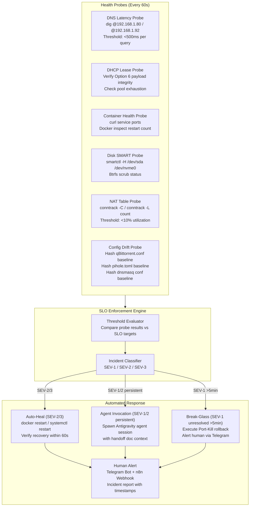

# 🗺️ Master Project Roadmap & Execution Queue

A persistent, cross-session Single Source of Truth (SoT) tracking active, completed, and verified projects across the home lab, autonomous agent swarm, Raspberry Pi 5, UGREEN NAS, and local AI pipelines.

---

## 🌟 Master Status Overview

| # | Project Name | Domain / Target | Status | Primary Interface / Ports | Test Suite & Docs |
| :--- | :--- | :--- | :--- | :--- | :--- |
| **01** | **Offline Socratic Tutor** | RAG / Education | 🟢 Production | Local RAG Pipeline (Ollama + NetworkX) | 4/4 Tests Passing ([Docs](raspberrypi/offline_tutor/README.md)) |
| **02** | **Git-Backed Second Brain** | PKM / Documentation | 🟢 Production | Gitea + Obsidian Webhook + ChromaDB | 3/3 Tests Passing ([Docs](raspberrypi/second_brain/README.md)) |
| **03** | **WhisperX Meeting Indexer** | Audio / Search | 🟢 Production | faster-whisper + Time-Window Vector Search | 5/5 Tests Passing ([Docs](raspberrypi/whisper_indexer/README.md)) |
| **04** | **UGREEN Photos AI Backup** | Photos / Cloud | 🟢 Production | Native UGOS AI (Deep & Pranali) + Immich Staging | 2/2 Tests Passing ([Docs](raspberrypi/immich/README.md)) |
| **05** | **Jellyfin Media Server** | Media Streaming | 🟢 Operational | Port `8096` (VideoCore VII DRM Fallback) | 4/4 Tests Passing ([Docs](raspberrypi/jellyfin/README.md)) |
| **06** | **Voice Clone TTS Sandbox** | Audio / ML | 🟢 Production | Coqui XTTS v2 / Local TTS Engine | 2/2 Tests Passing ([Docs](raspberrypi/voice_clone/README.md)) |
| **07** | **Backup Engine & Pixel Sync**| Storage / DR | 🟢 Production | Backblaze B2 Encrypted + Pixel 1 Sync Guard | 2/2 Tests Passing ([Docs](raspberrypi/backup_engine/README.md)) |
| **08** | **TripDrop Staging Portal** | Storage / Transfers | 🟢 Production | Port `8088` (FastAPI Chunked Upload + mDNS) | 2/2 Tests Passing ([Docs](raspberrypi/trip_drop/README.md)) |
| **09** | **Stirling-PDF Utility** | Tools / Productivity | 🟢 Production | Port `8083` (Docker Offline OCR Suite) | 1/1 Test Passing ([Docs](raspberrypi/stirling_pdf/README.md)) |
| **10** | **Intrusion Monitor** | Security / Defense | 🟢 Production | Scapy Frame Sniffer + UFW Tailing Daemon | 5/5 Tests Passing ([Docs](raspberrypi/intrusion_monitor/README.md)) |
| **11** | **Dead Man's Switch** | Security / Crypto | 🟢 Production | Shamir's Secret Sharing ($M_{521}$) Vault | 2/2 Tests Passing ([Docs](raspberrypi/deadmans_switch/README.md)) |
| **12** | **Pi-hole v6 DNS (Primary)** | Network / Privacy | 🟢 Production | Port `53`, `80`, `443` (Pi 5 Bare-Metal FTL) | 2/2 Tests Passing ([Docs](raspberrypi/pihole/README.md)) |
| **13** | **n8n Workflow Automation** | Automation / Pipelines | 🟢 Production | Port `5678` (Docker Workflow Engine) | 1/1 Test Passing ([Docs](raspberrypi/n8n/README.md)) |
| **14** | **Market Sentiment Tracker** | Finance / News RAG | 🟢 Production | RSS + VADER Analyzer + Ollama LLM | 5/5 Tests Passing ([Docs](raspberrypi/market_sentiment/README.md)) |
| **15** | **Financial Pipeline Dashboard** | Finance / Analytics | 🟢 Production | Statement Parser + SQLite + Portfolio NAV | 2/2 Tests Passing ([Docs](raspberrypi/financial_pipeline/README.md)) |
| **16** | **Morning Briefing Generator** | Productivity / Podcasts | 🟢 Production | Daily News & Sentiment Synthesizer | 2/2 Tests Passing ([Docs](raspberrypi/morning_briefing/README.md)) |
| **17** | **Plex + *Arr Automation Stack**| Media Automation | 🟢 Production | Ports `32400`, `9696`, `7878`, `8989`, `8080` (NAS) | 10/10 Tests Passing ([Docs](ugreen_nas/arr_stack/README.md)) |
| **18** | **Headless Jules Agent Worker**| Agent Swarm / CI/CD | 🟢 Production | Background Review Daemon (`worker.py`) | 5/5 Tests Passing ([Docs](raspberrypi/agent_worker/README.md)) |
| **19** | **Unbound Root Recursive DNS**| Network / Privacy | 🟢 Production | Port `127.0.0.1#5335` (DNSSEC Root Anchors) | Verified Operational ([Docs](raspberrypi/unbound/README.md)) |
| **20** | **High-Availability Dual Pi-hole** | Network / Redundancy | 🟢 Production | Port `53`, `8089` (UGREEN NAS + Gravity-Sync) | Verified Operational ([Docs](ugreen_nas/pihole/README.md)) |
| **21** | **Vaultwarden Password Manager** | Security / Identity | 🟢 Production | Port `8085`, `3012` (UGREEN NAS) | Verified Operational ([Docs](ugreen_nas/vaultwarden/README.md)) |
| **22** | **Homepage Unified Dashboard** | Homelab Management | 🟢 Production | Port `3000` (UGREEN NAS) | Verified Operational ([Docs](ugreen_nas/homepage/README.md)) |
| **23** | **macOS SMB File Sharing** | Storage / Transfers | 🟢 Production | Port `445` (`smb://192.168.1.80`) | Verified Operational ([Docs](ugreen_nas/smb/README.md)) |
| **24** | **AI Telegram Media Bot** | Media Automation / AI | 🟢 Operational | Telegram Bot Interface + Arr Stack Bridge | Unit Tests Passing ([Docs](ugreen_nas/telegram_bot/README.md)) |
| **25** | **Virtual Pixel 1 Digital Twin** | Photos / Cloud Storage | 🟢 Production | Port `5555` (`redroid-pixel1` on NVMe `/volume2`) | Verified Operational ([Docs](ugreen_nas/redroid/REDROID_PIXEL1_DIGITAL_TWIN.md)) |
| **26** | **Asymmetric Tiered Storage & Power Lifecycle** | Storage / Infrastructure | 🟢 Production | Hot NVMe Tier (`/volume2`) + Cold CMR HDD (`/volume1`) | Operational & Benchmarked ([Docs](ugreen_nas/storage/PHOTO_TIERED_STORAGE_DESIGN.md)) |
| **27** | **Zero-Copy Photo Direct Mount Pipeline** | Storage / Optimization Queue | 📝 Staged / Queue | Read-Only Bind Mount (`/volume1` $\rightarrow$ Redroid) + Inotify Scan | Architecture Documented ([Docs](ugreen_nas/storage/PHOTO_TIERED_STORAGE_DESIGN.md)) |
| **28** | **Ecosystem CI/CD & Anti-Flakiness Automation** | CI/CD / Testing | 🟢 Production | Multi-Repo Matrix (Pi 5, PWA, Market, Workflows) | 44/44 Pi 5 + 10/10 Market Tests Passing ([Docs](ci_cd_and_agentic_pipelines/README.md)) |
| **29** | **Jules Multi-Agent PR Reviewer & Blueprint v2.2.0** | Agent Swarm / CI/CD | 🟢 Production | Autonomous PR Reviewer + Keenable CLI Skills | Blueprint Tagged `v2.2.0` ([Docs](ci_cd_and_agentic_pipelines/JULES_MULTI_AGENT_PIPELINE.md)) |
| **30** | **Offline Knowledge Center PWA & Scraping Pipeline** | Web App / Knowledge Base | 🟢 Production | 19,086 Precached Offline Articles (GitHub Pages) | Automated CI Deploy ([Docs](ci_cd_and_agentic_pipelines/OFFLINE_KNOWLEDGE_PWA_PIPELINE.md)) |
| **31** | **SLO Watchdog Daemon (`slo-watchdog`)** | Reliability / SRE Automation | 📝 Staged / Queue | Daemon on Pi 5 + NAS polling DNS latency, DHCP health, container states, SMART, NAT counts | Architecture Documented ([Docs](#-project-31-slo-watchdog-daemon-specification)) |

---

## 🛠️ Global Execution Protocol for Agents
When initiating a session:
1. Reference this `PROJECTS_ROADMAP.md` to identify dependencies, interfaces, and target ports.
2. **Reference the domain-specific Handoff & SLA/SLO Contract** before making changes:
   - Media & *Arr Stack: [`ugreen_nas/MEDIA_STACK_HANDOFF.md`](ugreen_nas/MEDIA_STACK_HANDOFF.md)
   - DNS & Network: [`networking/DNS_NETWORK_HANDOFF.md`](networking/DNS_NETWORK_HANDOFF.md)
3. **Any SLO violation is an Incident.** Treat client-side degradation caused by homelab services as immediate-priority work. Refer to the Incident Classification Matrix in the relevant handoff document.
4. Verify system states before altering container bindings or disk mounts.
5. Synchronize changes to `deepshah08/Learning` repository.

---

## 🔒 Project #31: SLO Watchdog Daemon Specification

### Overview
A lightweight monitoring daemon that continuously validates SLO compliance across the Media Stack and DNS/Network Stack, automatically detects violations, triggers self-healing remediation, and invokes AI agents for persistent failures.

### Architecture

### Probe Specifications

| Probe | Target | Frequency | SLO Reference |
| :--- | :--- | :--- | :--- |
| **DNS Latency** | `dig +time=1 @192.168.1.80` and `@192.168.1.92` | Every 60s | DNS Handoff §6.1, §6.2 |
| **DHCP Lease Check** | Parse `/etc/pihole/dhcp.leases`, verify Option 6 via `nmap --script broadcast-dhcp-discover` | Every 5 min | DNS Handoff §6.2 |
| **Container Health** | `curl -s -o /dev/null -w '%{http_code}' http://localhost:<port>` for all services | Every 60s | Media Handoff §6.1-6.5, DNS Handoff §6.1 |
| **Disk SMART** | `smartctl -H`, `btrfs scrub status`, NVMe wear level | Every 1 hour | Media Handoff §6.6 |
| **NAT Table** | `conntrack -C` (count) on router or NAS | Every 60s | Media Handoff §6.3, DNS Handoff §6.5 |
| **Config Drift** | SHA-256 hash of `qBittorrent.conf`, `pihole.toml`, `99-dns-redundancy.conf` vs stored baseline | Every 15 min | Media Handoff §6.3, DNS Handoff §6.2 |
| **Blocklist Sync** | Compare `gravity.db` domain count hash between NAS and Pi 5 | Every 1 hour | DNS Handoff §6.2 |

### Deployment Plan
- **Runtime**: Python 3.11 script running as a systemd timer on Pi 5 (bare-metal).
- **Dependencies**: `dig`, `curl`, `smartctl`, `conntrack`, `sqlite3`, `ssh` (multiplexed).
- **Alerting**: n8n webhook at `http://192.168.1.92:5678/webhook/slo-violation` + Telegram Bot API.
- **Incident Log**: Append-only JSONL at `/home/deep/slo-watchdog/incidents.jsonl`.
- **Agent Invocation**: Spawns `agy` CLI session with the appropriate handoff document path as context.

### Implementation Status: 📝 Staged / Queued
This project requires a dedicated implementation session. Start a new conversation with the handoff documents as context.
