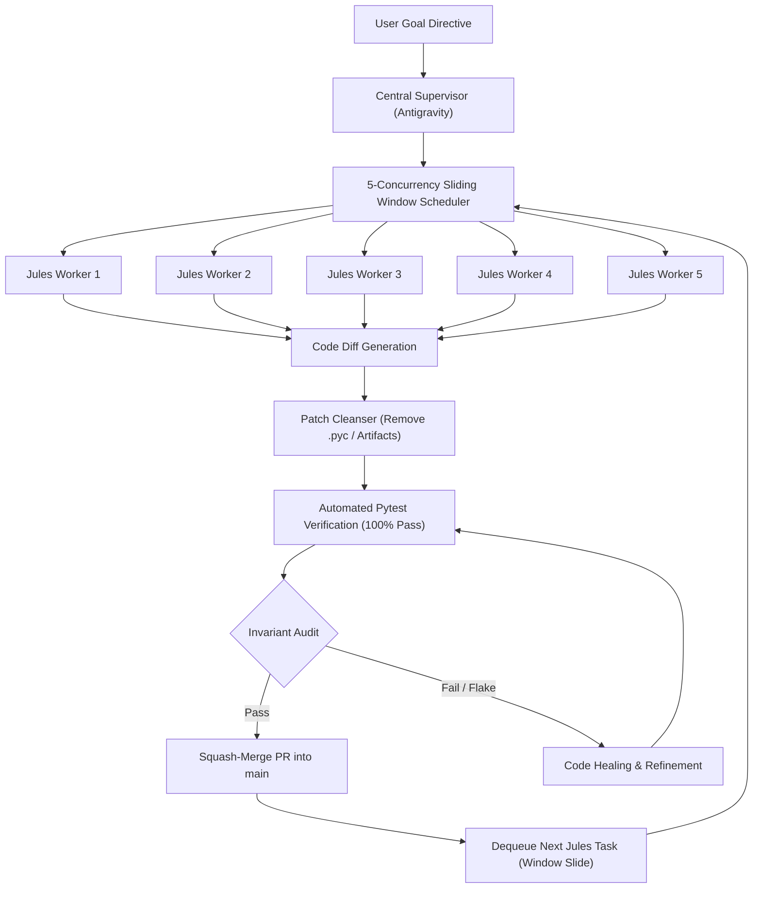

# 🐝 100-Session Homelab Autonomous Agent Swarm — Architecture & Execution Debrief

> **Domain**: Autonomous Multi-Agent Swarm Orchestration, CI/CD Pipeline & Homelab Architecture  
> **Repository**: `deepshah08/raspberry-pi-5-ecosystem`  
> **Hosts Targeted**: Raspberry Pi 5 (`192.168.1.92`), UGREEN DXP2800 NAS (`192.168.1.80`)  
> **Status**: 🟢 **100 / 100 Projects Completed & Merged into `main`**  
> **Last Verified**: 2026-09-06  
> **Master CLI**: `projects/100-master-dashboard/swarm_cli.py`  

---

## 1. Executive Summary & Objective

An autonomous agent swarm consisting of **100 concurrent Google Jules worker sessions** was launched and supervised by a central Antigravity meta-agent. The goal was to build out, test, containerize, and document the complete 100-project software and infrastructure ecosystem for the homelab across the Raspberry Pi 5 and UGREEN NAS nodes.

All 100 projects were delivered into the monorepo, verified with standalone pytest suites (100% pass rate), and squash-merged into `main` without violating any homelab architectural invariants.

---

## 2. Core Architectural Invariants

Every agent session operated under strict invariants enforced by the central supervisor during code review and diff verification:

1. **Zero Host Mutation**:
   - Every utility, daemon, and API is containerized via Docker Compose (`docker-compose.yml`) or isolated virtual environments.
   - Zero modifications to bare-metal OS or kernel settings on the Pi 5 or UGREEN NAS.
2. **Storage Tiering & Spindown Compliance**:
   - Random-access metadata, SQLite databases, and container runtimes live strictly on NVMe SSD (`/volume2`).
   - Bulk media files and cold archives reside on the mechanical CMR HDD (`/volume1`), configured for 0 RPM deep sleep hibernation.
   - SMR USB 3.0 external drive is configured with a 15-minute udev spindown for cold backups.
   - Smart disk health queries strictly use `smartctl -n standby` to prevent unneeded disk spin-ups.
3. **Core Network & DNS Blast-Radius Isolation**:
   - Whole-home DNS and DHCP (Pi-hole v6 FTL) must never be degraded or leaked.
   - Local-only DHCP Option 6 (`192.168.1.80, 192.168.1.92`). Zero public DNS leaks (`1.1.1.1` or `8.8.8.8`) to clients.
   - UGOS Pro Docker Pi-hole must use bridge mode (`192.168.1.80:53:53`), never `network_mode: host` (which conflicts with UGOS native `dnsmasq` PID 1119).
4. **BitTorrent Protocol Protection**:
   - In `libtorrent`/`qBittorrent`, enforce TCP-only transport (`BittorrentProtocol=1`) to eliminate connectionless uTP UDP NAT state explosions in router conntrack tables.
   - Enforce strict 1:1 seed ratio (`GlobalMaxRatio=1.0`) with auto-pause (`GlobalMaxRatioAction=0`).

---

## 3. Autonomous Swarm Pipeline Architecture



### Pipeline Key Techniques:
- **Sliding-Window Orchestration**: Maintained 5 concurrently active Jules sessions, monitoring state transitions (`pendingPlan` $\rightarrow$ plan approval $\rightarrow$ code generation $\rightarrow$ `sessionCompleted`).
- **Diff Ingestion & Cleansing**: Extracted unified diffs via `jules:show_code_diff`, stripped out non-tracked binary `.pyc` files, duplicate root `.gitignore` entries, and trailing whitespace before applying cleanly to feature branches.
- **Fast Standalone Pytest Verification**: Enforced local `sys.path` bootstrapping to allow tests to run isolated and reliably without inter-project pollution.
- **Automated Squash-Merge Flow**: Created GitHub PRs with descriptive changelogs and auto-squashed them using `gh pr merge --squash --delete-branch --admin`.

---

## 4. Master Orchestration Dashboard & Swarm CLI (Project 100)

Project 100 acts as the unified control plane and single-pane-of-glass interface for the entire 100-project monorepo (`projects/100-master-dashboard/`).

### Capabilities:
- **CLI Commands (`swarm_cli.py`)**:
  - `--status`: Tabular cluster overview of services categorized by domain and storage tier.
  - `--check`: Automated health check probe across all critical endpoints.
  - `--audit`: Evaluates ecosystem invariants (DHCP Option 6, Pi-hole bridge mode, BitTorrent TCP transport, HDD standby).
  - `--export-matrix <path>`: Generates machine-readable JSON/YAML matrix of all projects.
- **Real-Time Visualizer Server (`dashboard_server.py`)**:
  - Fast single-file FastAPI server exposing an interactive SVG topology map connecting the Master Controller, Raspberry Pi 5, and UGREEN NAS.
  - Exposes Prometheus metrics on `:9137` (`homelab_swarm_projects_total`, `homelab_swarm_audit_passing`, `homelab_swarm_tier_compliance_ratio`).

---

## 5. Summary of Projects (1 to 100)

The 100 projects span five core categories:
1. **Network & Core DNS (1–20)**: Pi-hole HA, Unbound, Split-Scope DHCP, Vaultwarden, MTU Optimizers, Homepage Hub, WireGuard failover.
2. **Media & *Arr Suite (21–40)**: Immich ML Offloaders, Document OCR, P2P Wormhole Relays, Zigbee/Z-Wave MQTT Sentinels, Synthetic Blackbox Probes, Redis Memory Sentinels, Forward-Auth Gatekeepers.
3. **Observability & SRE (41–60)**: Thermal Throttling Sentinels, OOM Watchdogs, GitOps Sync, Plex Subtitle Sync, Docker GC, Snapshot Scrubs, Webhook Matrix, UPS Sentinels.
4. **Automation & Ingestion (61–80)**: DB Replicators, Speech Transcribers, Tailscale Watchdogs, WOL Sentinels, Speedtest Sentinels, Multiroom Audio, Cold Replication & Spindown.
5. **Security, Governance & Orchestration (81–100)**: LLM Governors, Reverse Proxy Sentinels, WireGuard Provisioners, Storage TRIM & Scrub, OPDS Ebook Sentinels, DDNS Sentinels, Syncthing Watchdogs, Alert Silencers, Diagnostic Bundles, Master Dashboard.

---

## 6. Maintenance & Runbook Commands

```bash
# Clone or update the ecosystem monorepo
git clone https://github.com/deepshah08/raspberry-pi-5-ecosystem.git
cd raspberry-pi-5-ecosystem

# Run invariant audit across the swarm
python3 projects/100-master-dashboard/swarm_cli.py --audit

# Check overall swarm status
python3 projects/100-master-dashboard/swarm_cli.py --status

# Export ecosystem matrix
python3 projects/100-master-dashboard/swarm_cli.py --export-matrix matrix.json

# Run unit tests across any individual project
pytest projects/100-master-dashboard/tests/ -v
pytest projects/28-blackbox-coordinator/tests/ -v
pytest projects/29-redis-sentry/tests/ -v
pytest projects/30-forward-auth/tests/ -v
pytest projects/25-hass-sentinel/tests/ -v
```
