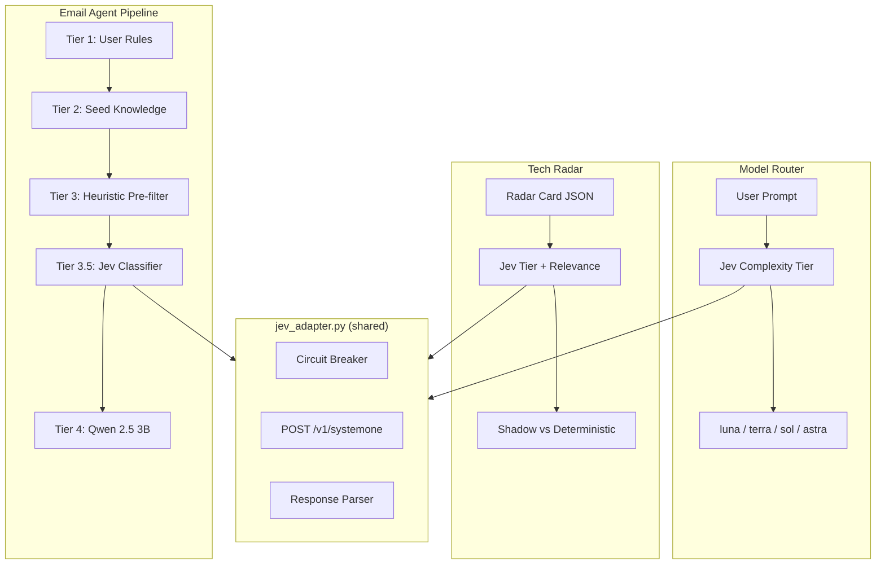

# Jev Decision Layer — Integration Architecture

> Companion: investigation journey at [./jev_decision_layer_investigation.md](./jev_decision_layer_investigation.md)

Status: **Shadow evaluation complete; live API verified**
Date: 2026-09-30
Modules: `agentic-workflows/jev_adapter.py`, `email-agent/jev_email_classifier.py`, `agentic-workflows/jev_model_router.py`, `agentic-workflows/jev_radar_classifier.py`

---

## What Is Jev

TypeSafe AI's **System One** non-autoregressive decision model. Instead of generating text token-by-token, it evaluates structured questions against a text state in a single forward pass and returns **calibrated probability distributions**.

Three primitives:

| Primitive | Returns | Example |
|---|---|---|
| **Noul** | `P(true) ∈ [0,1]` | "Does this email need a reply?" → `0.05` |
| **Choice** | `{label: probability}` distribution | "What category?" → `{Newsletter: 1.0, Spam: 0.0, …}` |
| **Score** | Ordinal value + confidence | "How many files?" → `score: 2.81, confidence: 0.83` |

### API Contract

```
POST https://api.typesafe.ai/v1/systemone
Authorization: Bearer $TYPESAFE_API_KEY

{
  "model": "jev-latest",         // pinnable: "jev-1.13.0"
  "state": "<text context>",
  "questions": {
    "question_name": {
      "type": "noul" | "choice" | "score",
      "instructions": "<what to evaluate>",
      "criteria": ...              // dict for choice, list for score
    }
  }
}
```

**Schema Rules Learned from Production Testing:**
- Choice: `criteria` is a **dict** `{label: description}`
- Score: `criteria` is an **ordered list** `["level_0", "level_1", ...]` (0-indexed)
- Noul: no `criteria` needed, just `instructions`
- Response: noul → `{"noul": 0.13}`, choice → `{"choice": "X", "probabilities": {...}}`, score → `{"score": 2.81, "probabilities": {...}}`

### Pricing

| Metric | Cost |
|---|---|
| Input tokens | \$0.042 / million |
| Output tokens | \$0.00 |
| Latency | 130–180ms observed (advertised 70–500ms) |

---

## Architecture: Three Integration Points



### 1. Email Labels (Tier 3.5)

Jev classifies `category`, `priority`, `action_needed`, and `auto_archive` in a single API call. Sits between heuristic pre-filter and Qwen 2.5 3B.

- **Confident** → returns `EmailClassification`, skips Qwen entirely
- **Low confidence** → returns `None`, pipeline falls through to Qwen
- **API error / breaker open** → returns `None`, pipeline unaffected

### 2. Pluggable Model Router (`jev_model_router.py`)

Sub-100ms complexity classifier routes tasks to the cheapest sufficient model tier. Designed with a **pluggable multi-harness architecture**:

| Jev Tier | Antigravity UI Model & Reasoning | Antigravity Subagent | Codex Equivalent | Claude Code | Use Case |
|---|---|---|---|---|---|
| `luna_light` | **Gemini 3.8 Flash (Low)** | `flash_lite` | Luna Light (Low) | Claude 3.5 Haiku | "thanks lgtm", typo fixes, extraction |
| `terra_medium` | **Gemini 3.8 Flash (Medium)** | `flash` | Terra Medium | Claude 3.7 Sonnet | Everyday implementation, refactors, tests |
| `sol_high` | **Gemini 3.8 Flash (High)** / 3.1 Pro | `pro` | Sol High | Claude 3.7 Sonnet (Thinking) | Tricky debugging, security, deep reasoning |
| `astra` | **Gemini 3.1 Pro (High)** / *Gemini 4 Pro* | `pro` | Astra | Claude Opus 4.6 (Thinking) | Cross-cutting architecture, sustained research |

**Pluggable Features:**
- Target harness selection: `classify_task_complexity(prompt, harness="antigravity" | "codex" | "claude" | "all")`
- Dynamic harness registration via `register_harness(name, profile)`
- Environment overrides for future-proofing models: `ANTIGRAVITY_FLASH_MODEL` (default: `Gemini 3.8 Flash`), `ANTIGRAVITY_PRO_MODEL` (default: `Gemini 3.1 Pro`), `ANTIGRAVITY_NEXTGEN_MODEL` (default: `Gemini 4 Pro`)
- Entropy-aware hedging: when Shannon entropy is high ($H_{\text{norm}} > 0.70$) or confidence margin is small ($p_{(1)} - p_{(2)} < 0.25$), automatically hedges by escalating reasoning effort.

### 3. Tech Radar Probabilistic Ranker (`jev_radar_classifier.py`)

Moves beyond binary bucketing into a continuous **Actionability Utility Index** ($U \in [0, 100]$):
$$U = \left( 1.0 \cdot P(\text{adopt}) + 0.60 \cdot P(\text{benchmark}) + 0.15 \cdot P(\text{horizon}) \right) \times \left( \frac{E[\text{relevance}]}{4.0} \right) \times (0.70 + 0.30 \cdot P(\text{reproducible})) \times 100$$

- Computes ordinal expected relevance $E[\text{relevance}]$ and dispersion $\sigma_{\text{relevance}}$ via `compute_ordinal_expectation`.
- Automatically sorts batch evaluation queues by Actionability Index descending.

### 4. CI/CD & PR Fast-Triage Gatekeeper (`jev_code_gatekeeper.py`)

Sub-150ms pre-review screener for agent swarms and pull requests:
- **Blast-Radius Risk Tier**: Evaluates `LOW` (docs/typos), `MEDIUM` (local refactor), `HIGH` (DB migration, async queues), `CRITICAL` (core network, keys).
- **Asymmetric Loss Matrix**: Missing a `CRITICAL` PR is penalized 100x vs false alarm (2x).
- **Automated Fast-Merge Gating**: Automatically approves low-risk documentation / formatting changes while routing breaking changes ($P > 0.40$) directly to multi-agent council review.

### 5. Semantic Safety Sentinel (`jev_safety_sentinel.py`)

Real-time, sub-130ms semantic firewall screening untrusted external inputs (emails, web scrapes, webhook payloads) before passing to agent tool execution contexts:
- Parallel evaluation of `prompt_injection_risk`, `data_exfiltration_risk`, and `destructive_command_risk`.
- Asymmetric loss minimization: missing malicious prompt injection penalized 100x.
- Enforcement actions: `PASS` (safe), `SANITIZE_AND_WARN` (suspicious), `BLOCK` (malicious).

---

## Probabilistic Decision Engine (`jev_decision_engine.py`)

Non-autoregressive decision models return full probability distributions over discrete outcomes. The decision engine extracts maximum signal using formal mathematical frameworks:

### 1. Information-Theoretic Uncertainty (Shannon Entropy & Margin)
* **Shannon Entropy**: $H(P) = -\sum_{i=1}^K p_i \log_2(p_i + \epsilon)$
* **Normalized Entropy**: $H_{\text{norm}}(P) = \frac{H(P)}{\log_2(K)} \in [0, 1]$
* **Margin of Confidence**: $M(P) = p_{(1)} - p_{(2)}$ (gap between rank-1 and rank-2 candidates).
* **Decisiveness Gate**: A decision is decisive iff $M(P) \ge 0.25$ and $H_{\text{norm}}(P) \le 0.70$. High entropy triggers precautionary hedging.

### 2. Bayes Optimal Decision Rule (Cost-Sensitive Matrix)
In operational systems, false negative on critical events is vastly more costly than false positive.
* **Bayes Expected Risk**: $R(\hat{y} = k \mid x) = \sum_{j} L(y=j, \hat{y}=k) \cdot P(y=j \mid x)$
* **Optimal Action**: $\hat{y}^* = \arg\min_k R(\hat{y} = k \mid x)$
* **Email Priority Loss Matrix**: Missing `URGENT` carries a $100\times$ penalty $\to$ flips priority to `URGENT` even when posterior $P(\text{URGENT}) \approx 0.15$.

### 3. Ordinal Scale Expectations
For ordered multi-class questions (e.g. scope 0..4, relevance 0..4):
* **Expected Value**: $E[X] = \sum x \cdot P(x)$
* **Variance & Spread**: $\text{Var}(X) = \sum (x - E[X])^2 \cdot P(x), \quad \sigma_X = \sqrt{\text{Var}(X)}$

---

## High-Availability: Circuit Breaker

The adapter **never raises an exception**. `evaluate()` is wrapped in a catch-all.

```
HTTP Status → Breaker Behavior
─────────────────────────────────────────
200 OK       → Reset failure counter
402 Credits  → IMMEDIATE open (5 min cooldown)
401 Auth     → IMMEDIATE open (5 min cooldown)
429 Rate     → Count failure (3 strikes → 60s)
5xx Server   → Count failure (3 strikes → 60s)
422 Schema   → Log only, do NOT trip breaker
Timeout      → Count failure
Connection   → Count failure
Any exception → Swallowed, count failure
```

When the breaker is open, all calls return `None` in **0ms** — no latency penalty. Callers fall through to their existing baselines (Qwen, manual routing, deterministic rubric).

Configuration via environment variables:

| Env Var | Default | Purpose |
|---|---|---|
| `TYPESAFE_API_KEY` | (none) | API key; unset = Jev disabled |
| `JEV_ENABLED` | `true` | Kill switch |
| `JEV_MODEL` | `jev-latest` | Pin version (e.g. `jev-1.13.0`) |
| `JEV_TIMEOUT_SEC` | `2.0` | Per-call timeout |
| `JEV_CONFIDENCE_THRESHOLD` | `0.7` | Min confidence to trust result |
| `JEV_BREAKER_THRESHOLD` | `3` | Failures before breaker opens |
| `JEV_BREAKER_COOLDOWN_SEC` | `60` | Transient error cooldown |
| `JEV_BREAKER_CREDIT_COOLDOWN_SEC` | `300` | Credit/auth error cooldown |

---

## English-Only Policy (Section 6 of AGENTS.md)

Established 2026-09-30 as a global agent directive. When selecting model checkpoints (Laya, Jev, Qwen, BERT variants), always prefer English-only checkpoints over multilingual. Do not attempt to prune shared transformer weights. Exception: TTS/ASR retain Hindi + Gujarati for family use.

---

## Files

| File | Repo | Purpose |
|---|---|---|
| `jev_adapter.py` | agentic-workflows | Core adapter + HA circuit breaker |
| `jev_decision_engine.py` | agentic-workflows | Mathematical decision theory, entropy, Bayes loss matrices |
| `jev_model_router.py` | agentic-workflows | Pluggable model router with entropy hedging (Antigravity/Codex/Claude) |
| `jev_code_gatekeeper.py` | agentic-workflows | CI/CD PR blast-radius & fast-merge gatekeeper |
| `jev_safety_sentinel.py` | agentic-workflows | Sub-130ms semantic security guard & prompt injection screener |
| `jev_radar_classifier.py` | agentic-workflows | Tech radar classifier with Actionability Utility Index ranking |
| `jev_email_classifier.py` | email-agent | Email Tier 3.5 Bayesian precision classifier |
| `email_classifier.py` | email-agent | 5-tier email classification engine integration |
| `docs/JEV_LAYA_DECISION_LAYER.md` | agentic-workflows | Decision layer status doc |
| `radar/jev_shadow_eval.json` | agentic-workflows | Shadow evaluation results |
| `AGENTS.md` | DATA ORG root & Learning | Section 6: English-Only directive |
