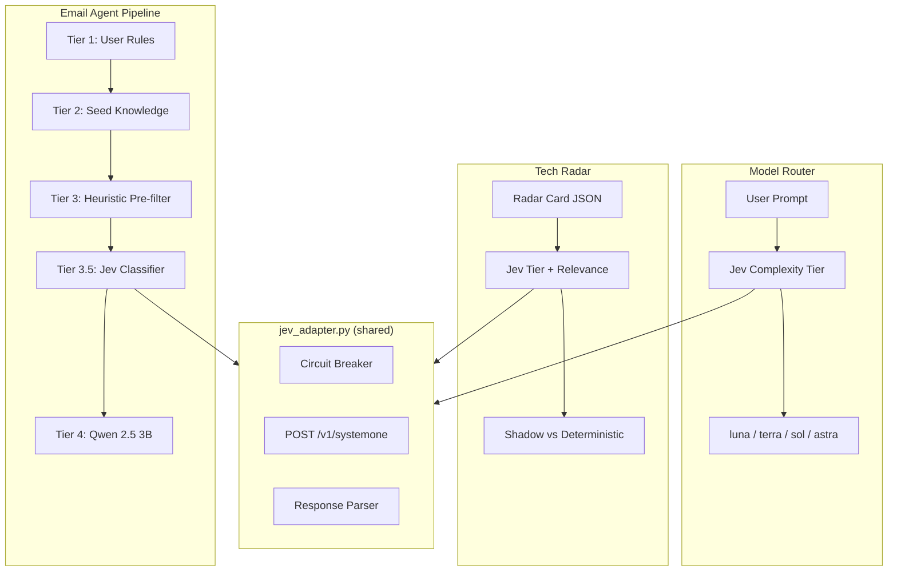

# Jev Decision Layer — Integration Architecture

> Companion: investigation journey at [./jev_decision_layer_investigation.md](./jev_decision_layer_investigation.md)

Status: **Shadow evaluation complete; live API verified**
Date: 2026-09-30
Modules: `agentic-workflows/jev_adapter.py`, `email-agent/jev_email_classifier.py`, `agentic-workflows/jev_model_router.py`, `agentic-workflows/jev_radar_classifier.py`

---

## What Is Jev

TypeSafe AI's **System One** non-autoregressive decision model. Instead of generating text token-by-token, it evaluates structured questions against a text state in a single forward pass and returns **calibrated probability distributions**.

Three primitives:

| Primitive | Returns | Example |
|---|---|---|
| **Noul** | `P(true) ∈ [0,1]` | "Does this email need a reply?" → `0.05` |
| **Choice** | `{label: probability}` distribution | "What category?" → `{Newsletter: 1.0, Spam: 0.0, …}` |
| **Score** | Ordinal value + confidence | "How many files?" → `score: 2.81, confidence: 0.83` |

### API Contract

```
POST https://api.typesafe.ai/v1/systemone
Authorization: Bearer $TYPESAFE_API_KEY

{
  "model": "jev-latest",         // pinnable: "jev-1.13.0"
  "state": "<text context>",
  "questions": {
    "question_name": {
      "type": "noul" | "choice" | "score",
      "instructions": "<what to evaluate>",
      "criteria": ...              // dict for choice, list for score
    }
  }
}
```

**Schema Rules Learned from Production Testing:**
- Choice: `criteria` is a **dict** `{label: description}`
- Score: `criteria` is an **ordered list** `["level_0", "level_1", ...]` (0-indexed)
- Noul: no `criteria` needed, just `instructions`
- Response: noul → `{"noul": 0.13}`, choice → `{"choice": "X", "probabilities": {...}}`, score → `{"score": 2.81, "probabilities": {...}}`

### Pricing

| Metric | Cost |
|---|---|
| Input tokens | \$0.042 / million |
| Output tokens | \$0.00 |
| Latency | 130–180ms observed (advertised 70–500ms) |

---

## Architecture: Three Integration Points



### 1. Email Labels (Tier 3.5)

Jev classifies `category`, `priority`, `action_needed`, and `auto_archive` in a single API call. Sits between heuristic pre-filter and Qwen 2.5 3B.

- **Confident** → returns `EmailClassification`, skips Qwen entirely
- **Low confidence** → returns `None`, pipeline falls through to Qwen
- **API error / breaker open** → returns `None`, pipeline unaffected

### 2. Model Routing

Sub-100ms complexity classifier routes tasks to the cheapest sufficient model tier:

| Jev Tier | Model | Use Case |
|---|---|---|
| `luna_light` | flash_lite | "thanks lgtm", typo fixes |
| `terra_medium` | flash | Everyday implementation, refactors |
| `sol_high` | pro | Debugging, security, design decisions |
| `astra` | pro | Cross-cutting architecture, research |

Cross-validation guards: deep reasoning flag escalates luna→terra; scope≥4 escalates luna→terra.

### 3. Tech Radar Tier Classification

Classifies radar cards into `adopt_candidate`, `benchmark_candidate`, `horizon_watch`, `abstain` alongside reproducibility evidence and workflow relevance scoring.

Shadow evaluation on 55 cards (2026-09-30): 27.8% agreement with deterministic rubric — Jev is systematically more conservative on "Adopt" (wants benchmark first) and upgrades "Horizon Watch" cards to benchmark consideration.

---

## High-Availability: Circuit Breaker

The adapter **never raises an exception**. `evaluate()` is wrapped in a catch-all.

```
HTTP Status → Breaker Behavior
─────────────────────────────────────────
200 OK       → Reset failure counter
402 Credits  → IMMEDIATE open (5 min cooldown)
401 Auth     → IMMEDIATE open (5 min cooldown)
429 Rate     → Count failure (3 strikes → 60s)
5xx Server   → Count failure (3 strikes → 60s)
422 Schema   → Log only, do NOT trip breaker
Timeout      → Count failure
Connection   → Count failure
Any exception → Swallowed, count failure
```

When the breaker is open, all calls return `None` in **0ms** — no latency penalty. Callers fall through to their existing baselines (Qwen, manual routing, deterministic rubric).

Configuration via environment variables:

| Env Var | Default | Purpose |
|---|---|---|
| `TYPESAFE_API_KEY` | (none) | API key; unset = Jev disabled |
| `JEV_ENABLED` | `true` | Kill switch |
| `JEV_MODEL` | `jev-latest` | Pin version (e.g. `jev-1.13.0`) |
| `JEV_TIMEOUT_SEC` | `2.0` | Per-call timeout |
| `JEV_CONFIDENCE_THRESHOLD` | `0.7` | Min confidence to trust result |
| `JEV_BREAKER_THRESHOLD` | `3` | Failures before breaker opens |
| `JEV_BREAKER_COOLDOWN_SEC` | `60` | Transient error cooldown |
| `JEV_BREAKER_CREDIT_COOLDOWN_SEC` | `300` | Credit/auth error cooldown |

---

## English-Only Policy (Section 6 of AGENTS.md)

Established 2026-09-30 as a global agent directive. When selecting model checkpoints (Laya, Jev, Qwen, BERT variants), always prefer English-only checkpoints over multilingual. Do not attempt to prune shared transformer weights. Exception: TTS/ASR retain Hindi + Gujarati for family use.

---

## Files

| File | Repo | Purpose |
|---|---|---|
| `jev_adapter.py` | agentic-workflows | Core adapter + circuit breaker |
| `jev_model_router.py` | agentic-workflows | Model complexity classifier |
| `jev_radar_classifier.py` | agentic-workflows | Radar tier classifier + shadow eval |
| `jev_email_classifier.py` | email-agent | Email Tier 3.5 classifier |
| `email_classifier.py` | email-agent | Modified: Jev import + Tier 3.5 wiring |
| `docs/JEV_LAYA_DECISION_LAYER.md` | agentic-workflows | Decision layer status doc |
| `radar/jev_shadow_eval.json` | agentic-workflows | Shadow evaluation results |
| `AGENTS.md` | DATA ORG root | Section 6: English-Only directive |
