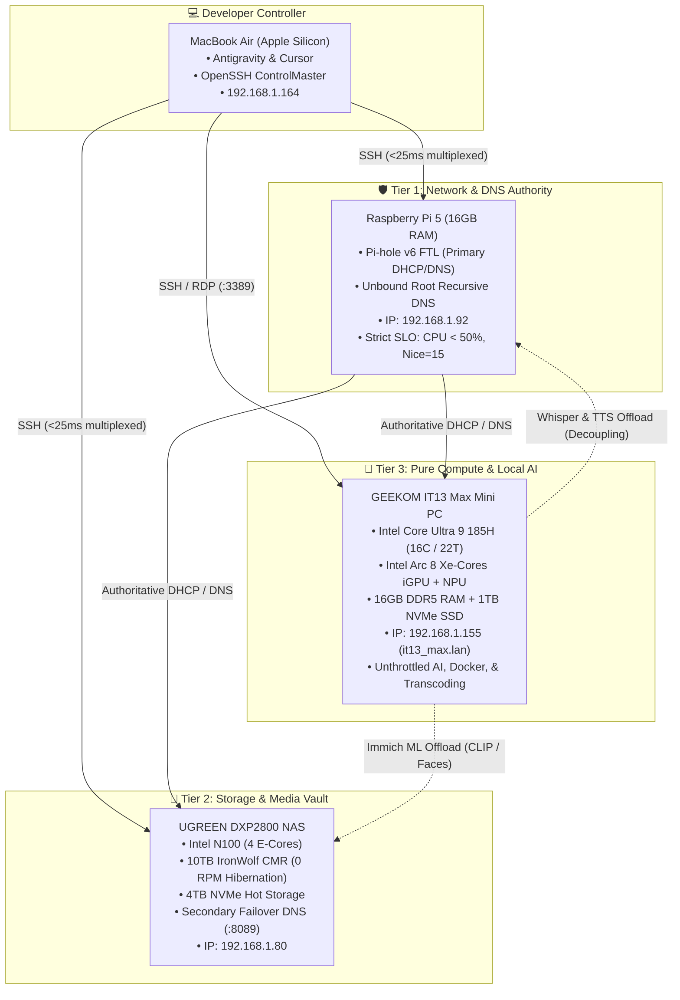
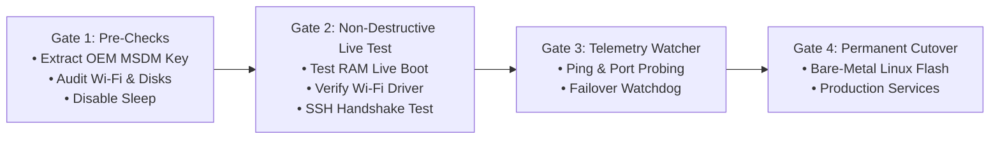

# ⚡ Node 3: GEEKOM IT13 Max — Dedicated AI & Compute Architecture

> Hardware inventory, original architecture, and provisioning record for Node 3. The
> deployed runtime source and current execution evidence are maintained in the private
> [IT13 Max repository](https://github.com/deepshah08/it13max).  
> **Last reviewed**: 2026-09-22  
> **Status**: ✅ Goals 1–6 deployed; remediation complete pending independent Astra review.

The paired MDS documents capture the implementation journey and current design
rationale: [investigation](./it13max_investigation.md) ·
[durable knowledge](./it13max_knowledge.md). Goal 5 model evaluation remains deferred
until representative labels exist. See the source repository's execution records for
the exact acceptance evidence and remaining user configuration.

---

## 🏛️ 1. Homelab System Topology



---

## ⚙️ 2. Configuration Parameter Matrix

| Parameter | Value | Verification Command / Context |
| :--- | :--- | :--- |
| **Hostname** | `it13_max.lan` / `it13max` | Bound in `/etc/dnsmasq.d/99-static-reservations.conf` |
| **Static IP Address** | `192.168.1.155` | Authoritative reservation via Pi-hole v6 on Pi 5 |
| **Physical MAC Address** | `f8:cf:52:eb:88:e0` | Intel Wi-Fi Adapter hardware address |
| **Processor (CPU)** | Intel Core Ultra 9 185H | 16 Cores / 22 Threads (6P + 8E + 2LP-E, up to 5.1 GHz) |
| **GPU / AI Acceleration** | Intel Arc iGPU (8 Xe-cores) + NPU | OpenVINO, DirectML, Intel oneAPI (`/dev/dri`) |
| **System Memory (RAM)** | 16 GB DDR5 | High-bandwidth unified memory for local LLM inference |
| **Primary Storage** | 1 TB Gen4 NVMe PCIe SSD | High-speed hot tier for Docker containers & model weights |
| **Network Interfaces** | Wi-Fi 6E/7 + 2.5GbE RJ45 | Default Wi-Fi connection on `192.168.1.0/24` subnet |
| **Remote Access Ports** | Port 22 (SSH), Port 3389 (RDP) | Headless orchestration pipeline |

---

## 🛡️ 3. Fail-Safe Migration & Pre-Check Gates

To guarantee zero downtime, no bricking, and full recovery assurance, the migration adheres to four strict gatekeepers:



### Gate 1: Telemetry & License Extraction (Windows 11)
Run `scripts/01_precheck_windows_telemetry.ps1` on the IT13 Max:
- Extracts the permanent 25-character OEM Windows 11 Pro digital key from ACPI `MSDM`.
- Backs up Wi-Fi profile and cryptographic pre-shared key.
- Disables sleep, standby, and hibernation (`powercfg -change -standby-timeout-ac 0`).
- Generates `C:\Users\deep\Desktop\it13max_precheck_report.txt`.

### Gate 2: Non-Destructive Live Boot Validation
Before any partition format:
- Boot an ephemeral Linux live image in memory.
- Confirm Intel AX211/BE200 Wi-Fi driver binds and joins the network.
- Confirm SSH connection succeeds from the Mac.

### Gate 3: Watcher Agent Telemetry
Run `scripts/02_watcher_probe.sh` on the Mac:
- Logs every state change (UP/DOWN, Port 22 OPEN/CLOSED, Port 3389 OPEN/CLOSED).
- Prevents remote blindness during boot phase transitions.

### Gate 4: Cutover to Bare-Metal Linux
Once Gate 2 and Gate 3 succeed:
- Format the 1TB NVMe to `ext4` / `btrfs`.
- Deploy Ubuntu Server 24.04 LTS with Linux kernel 6.8+.
- Configure OpenSSH key-based authentication with `~/.ssh/controlmasters/%r@%h:%p`.

---

## 🚀 4. Live CLI Health-Check & Verification Commands

Run these commands from your Mac to monitor and verify node health:

```bash
# 1. Immediate ICMP Reachability Check
ping -c 3 192.168.1.155

# 2. Port Audit (SSH & RDP)
nc -zv -G 1 192.168.1.155 22 3389

# 3. Query Pi-hole DHCP Lease State (via Pi 5)
ssh -o BatchMode=yes pi5 "sudo cat /etc/pihole/dhcp.leases | grep 192.168.1.155"

# 4. Background Watcher Daemon
./scripts/02_watcher_probe.sh

# 5. Multiplexed Shell Login (Once SSH is active)
ssh it13max
```

---

## 🔄 5. Disaster Recovery & Rollback Plan

For complete rollback instructions, refer to [`scripts/03_rollback_and_disaster_recovery.md`](scripts/03_rollback_and_disaster_recovery.md).

### Summary Rollback Steps:
1. **OEM License Preservation**: The Windows 11 Pro license is permanently embedded in the motherboard's ACPI `MSDM` table. It cannot be lost or erased by disk formatting.
2. **Factory Windows 11 Restoration**:
   - Download official Microsoft Windows 11 ISO.
   - Flash to USB using BalenaEtcher / Raspberry Pi Imager.
   - Boot IT13 Max, tap `F7` for boot menu, select USB.
   - Select Windows 11 Pro; digital activation occurs automatically over the internet.
   - Install GEEKOM Meteor Lake driver pack.
