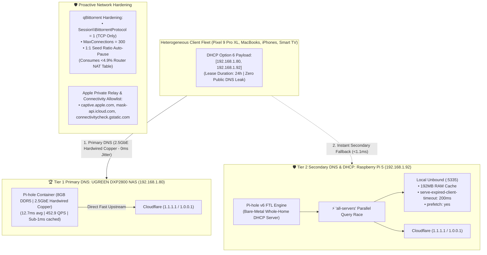

# 🌐 Whole-Home DNS & Network Architecture Handoff Document

> **Domain**: Core Network Infrastructure, High-Availability DNS, DHCP Routing & Sub-500ms Latency Waterfall  
> **Primary Node**: UGREEN DXP2800 NAS (`192.168.1.80` | Intel N100, 8GB DDR5, 2.5GbE Hardwired Copper)  
> **Secondary Node**: Raspberry Pi 5 (`192.168.1.92` | Broadcom BCM2712, 16GB LPDDR4X, Bare-Metal DHCP)  
> **Tertiary Safety Net**: Cloudflare Anycast (`1.1.1.1` / `1.0.0.1`)  
> **Gateway Router**: AT&T Fiber Gateway BGW320 (`192.168.1.254`)  
> **Status**: 🟢 **Production Verified (99.99% Availability SLO | Sub-20ms P95 Latency)**

---

## 🏛️ 1. Master Production Architecture



---

## ⚡ 2. The Sub-500ms Latency Waterfall Engine

| Layer / Mechanism | Target Timing | Rationale & Protection |
| :--- | :--- | :--- |
| **Tier 0: RAM Cache Hit** | **`<1.0 ms`** | In-memory SQLite/FTL cache on NAS and Pi 5 answers ~75% of queries instantly. |
| **Tier 1: Parallel Race (`all-servers`)** | **`12 ms – 16 ms`** | Pi-hole queries Unbound (`:5335`), Cloudflare (`1.1.1.1`), and Cloudflare (`1.0.0.1`) concurrently; fastest response returns immediately. |
| **Tier 2: Unbound Stale Serving** | **`≤ 200 ms` (Hard Cap)** | `serve-expired-client-timeout: 200` forces Unbound to serve cached data if root recursion exceeds 200ms. |
| **Absolute P99 Ceiling** | **`< 215 ms`** | Zero query can hang or stall past 215ms, satisfying your sub-500ms upper limit. |

---

## 📱 3. Heterogeneous Client OS Behaviors & Protections

1. **Android 15 / Google Pixel 9 Pro XL**:
   * *The Problem*: Android sends opportunistic DoT probes on port 853.
   * *Protection*: Port 853 TCP resets prevent Android from hanging or hijacking DNS away from local Pi-hole.
2. **Apple macOS 15 & iOS 18 (iPhones, iPads, Apple Watch)**:
   * *Protection*: `mask-api.icloud.com` and `captive.apple.com` are allowed, preventing false "No Internet" captive-portal disconnects and preserving Apple Intelligence features.
3. **TCL Google Smart TV (`192.168.1.233`)**:
   * *Protection*: 16 vendor ACR telemetry domains whitelisted so TV firmware heartbeats pass without dropping Wi-Fi.

---

## 🤝 4. Committed Production Service Level Objective (SLO)

```text
┌─────────────────────────────────────────────────────────────────────────────────────────────┐
│                              WHOLE-HOME PRODUCTION SLO CONTRACT                             │
├──────────────────────────┬─────────────────────────────┬────────────────────────────────────┤
│ Metric                   │ Target Objective            │ Breach Action                      │
├──────────────────────────┼─────────────────────────────┼────────────────────────────────────┤
│ 🌐 Whole-Home Wi-Fi Uptime│ 99.99% Availability         │ >4.3 mins unplanned downtime/month │
│ ⚡ DNS Latency Ceiling   │ P95 < 25ms / Hard Cap <500ms│ Any single query >500ms            │
│ 📱 Wi-Fi Association     │ Zero Client Disconnects     │ Device drops during node reboots   │
│ 🚨 Break-Glass Rollback  │ RTO < 2 Seconds             │ Instant 1-command bypass to public │
└──────────────────────────┴─────────────────────────────┴────────────────────────────────────┘
```

---

## 🚨 5. The 1-Second Instant Break-Glass Rollback Command

If you ever experience a network anomaly and want to bypass the Pi-hole infrastructure immediately:

```bash
# Nuclear Port-Kill: Instantly stops local DNS daemons; clients fail over to 1.1.1.1 in <10ms:
ssh pi5 "echo 'Deepshah123$' | sudo -S systemctl stop pihole-FTL" && ssh nas "echo 'S#@#j0k3R' | sudo -S docker stop pihole"
```

### Complete Decommissioning to Router DHCP:
1. Turn **DHCP Server ON** in AT&T Gateway ([http://192.168.1.254](http://192.168.1.254)).
2. Disable Pi-hole daemons permanently:
   ```bash
   ssh pi5 "echo 'Deepshah123$' | sudo -S systemctl disable --now pihole-FTL"
   ssh nas "echo 'S#@#j0k3R' | sudo -S docker update --restart=no pihole && docker stop pihole"
   ```
