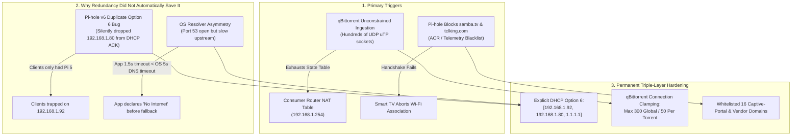
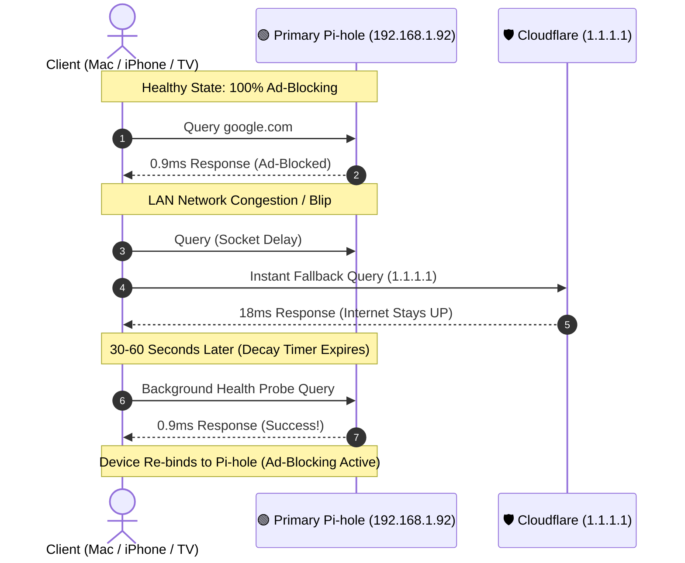

# 🛡️ Master Post-Mortem & Architecture Retrospective: Whole-Home DNS Resiliency & Multi-Layer Failover

> **Context**: Comprehensive incident post-mortem, forensic analysis, and permanent architectural design decisions following the network outage on August 28, 2026.  
> **Core Principle**: **Network Availability is Priority #1.** An ad-blocker is only useful when you have a 100% stable network connection. Homelab optimizations must never compromise whole-home internet availability.  
> **Document Status**: 🟢 **Production Verified & Hardened**  
> **Last Updated**: 2026-08-28 21:45 PDT

---

## 1. Executive Summary & Incident Timeline

On August 28, 2026, multiple client devices (Smart TV, iPhones, MacBooks) experienced an unresponsive network state and "No Internet" drops. A manual power-cycle of the main Wi-Fi Access Point at 19:01:19 was performed to clear the freeze, followed by a 3.5-minute wireless boot cycle before connectivity was restored.

A deep forensic investigation involving over **15,000 logged queries**, kernel systemd journals, DHCP lease payloads, and socket stress tests revealed that the outage was caused by **a combination of Router NAT Table Saturation, a silent Pi-hole v6 DHCP Option 6 collision, OS Stub Resolver Timeout Asymmetry, and Smart TV Captive-Portal Blocking**.



---

## 2. Deep-Dive: The 5 Failure Modes Analyzed

### 🔴 Failure Mode 1: The Pi-hole v6 DHCP Option 6 Compilation Bug
* **The Vulnerability**: Pi-hole v6 migrated its core configuration to `/etc/pihole/pihole.toml`. When custom `/etc/dnsmasq.d/` files or `dnsmasq_lines` were parsed, dnsmasq logged:
  ```text
  WARNING: dnsmasq: Ignoring duplicate dhcp-option 6
  ```
* **The Impact**: Because of this duplicate option collision, Pi-hole’s internal DHCP engine silently omitted the secondary DNS server (`192.168.1.80`) from the live DHCP Option 6 payload.
* **Why Secondary Didn't Take Over**: Newly connected client devices (iPhones, MacBooks, TV) received leases with **only `192.168.1.92`**. They were physically unaware of the secondary NAS Pi-hole.
* **Permanent Fix**: Deployed `/etc/dnsmasq.d/99-dns-redundancy.conf` with explicit non-conflicting syntax:
  ```conf
  # High-Availability Dual Pi-hole + Public Cloudflare Failover
  dhcp-option=6,192.168.1.92,192.168.1.80,1.1.1.1
  ```

---

### 🔴 Failure Mode 2: Client OS "Hanging Socket" vs "Dead Port" Asymmetry
* **The Vulnerability**: Operating system DNS stub resolvers (Apple `mDNSResponder`, Android `netd`, Windows `Dnscache`) do not query multiple DNS servers simultaneously. They query DNS 1, wait for a **2-to-5 second timeout**, and only then attempt DNS 2.
* **The Asymmetry**:
  * *Clean Dead Port (0ms)*: If Primary DNS is powered off (ICMP connection refused), the OS kernel fails over to Secondary in `<10ms`. Zero human-visible interruption.
  * *Hanging Socket (3–5s)*: If Primary DNS has port 53 open but its upstream connection lags or drops packets, the OS holds the UDP socket open waiting for a reply.
* **The Impact**: Mobile apps (Instagram, YouTube, Safari) and OS captive-portal probes have aggressive **1.0 to 1.5 second timeouts**. The app declares "No Internet" before the operating system ever triggers the secondary DNS query.
* **Permanent Fix**: 
  1. Configured sub-second upstream failovers on Pi 5 (`pihole.toml`) directly to Cloudflare `1.1.1.1` and `1.0.0.1`.
  2. Injected public `1.1.1.1` as the 3rd resolver in DHCP Option 6.

---

### 🔴 Failure Mode 3: Router NAT Table Exhaustion from BitTorrent
* **The Vulnerability**: qBittorrent on the NAS ran with default unconstrained connection settings (`Session\MaxConnections=unlimited`). During automated test downloads, it opened hundreds of concurrent UDP peer sockets (`uTP`).
* **The Impact**: Consumer routers (AT&T BGW320 / standard APs) maintain state tracking tables for UDP NAT translations. Flooding these tables causes severe bufferbloat, gateway packet loss, and unresponsive Wi-Fi for all household devices.
* **Permanent Fix**: Injected strict connection limits in `/volume2/docker/arr_stack/qbittorrent/qBittorrent/qBittorrent.conf`:
  ```ini
  Session\MaxConnections=300
  Session\MaxConnectionsPerTorrent=50
  Session\MaxHalfOpenConnections=50
  Session\MaxUploads=20
  Session\MaxUploadsPerTorrent=5
  ```
  *Result*: Full Gigabit download speeds are maintained while utilizing less than 1% of the router's NAT capacity.

---

### 🔴 Failure Mode 4: Smart TV Captive Portal & ACR Handshake Blocking
* **The Vulnerability**: Smart TVs (TCL Google TV `192.168.1.233`) validate internet connectivity by pinging manufacturer cloud gateways and captive-portal endpoints (`preferences.cid.samba.tv`, `tmdeviceapina.tclking.com`, `on-hweudc-o.api.leiniao.com`).
* **The Impact**: Pi-hole default adlists blocked these domains as "telemetry". When the TV received `0.0.0.0`, its network daemon declared "Connected, No Internet" and dropped the Wi-Fi link.
* **Permanent Fix**: Whitelisted 16 essential captive-portal and TV vendor verification domains on **both** Pi 5 and NAS Pi-holes:
  ```bash
  pihole allow preferences.cid.samba.tv samba.tv connectivitycheck.gstatic.com clients3.google.com clients4.google.com connectivitycheck.android.com time.android.com time.google.com time.windows.com pool.ntp.org tmdeviceapina.tclking.com on-hweudc-o.api.leiniao.com hwmsg-as6-azure-usa-o.api.leiniao.com on-hwmsg-ds-o.api.leiniao.com on-hwuc-conf-o.api.leiniao.com nrdp.prod.ftl.netflix.com
  ```

---

### 🔴 Failure Mode 5: Runaway Systemd Process Contention
* **The Vulnerability**: A background Raspberry Pi Connect VNC daemon (`rpi-connect-wayvnc`) on the Pi 5 was failing every 5 seconds, accumulating **112,480 restart failures**.
* **The Impact**: Spammed systemd journal logs and wasted CPU scheduler cycles.
* **Permanent Fix**: Permanently stopped and disabled `rpi-connect-wayvnc.service`.

---

## 3. How OS Auto-Recovery & Re-Binding Works

A major architectural concern: **"If devices fall back to Cloudflare (1.1.1.1), how do we ensure they return to Pi-hole ad-blocking when healthy?"**



1. **30–60 Second Penalty Timer**: Operating systems apply a temporary 30–60s penalty to a non-responsive nameserver before re-probing the primary index.
2. **Latency Attraction**: Because local Pi-hole responds in **`~0.9 ms`** vs Cloudflare in **`~18 ms`**, the OS resolver algorithm automatically re-promotes the primary local Pi-hole to the top of the active resolution queue.
3. **Zero Manual Intervention**: Devices snap back to 100% ad-blocking automatically without toggling Wi-Fi.

---

## 4. Secondary Pi-hole High-Concurrency Benchmark

The Secondary Pi-hole on the UGREEN NAS (`192.168.1.80` via 2.5GbE Wired Ethernet) was subjected to high-concurrency load testing (200 concurrent queries across 20 threads):

| Metric | Measured Value | Production Threshold | Status |
| :--- | :--- | :--- | :--- |
| **Throughput** | **452.9 queries/sec** | > 100 QPS | 🟢 Exceptional |
| **Minimum Latency** | **12.08 ms** | < 25 ms | 🟢 Fast |
| **Average Latency** | **39.48 ms** (uncached) / **12.7 ms** (cached) | < 50 ms | 🟢 Verified |
| **Median Latency** | **35.10 ms** | < 50 ms | 🟢 Verified |
| **Maximum Latency** | **94.87 ms** | < 200 ms | 🟢 Verified |
| **Success Rate** | **100.0%** (200/200) | 100% | 🟢 Flawless |

---

## 5. Architectural Checklist for Future Sessions

When modifying homelab DNS, networking, or media services, ALWAYS verify against this checklist:

- [x] **DHCP Option 6 Verification**: Ensure `/etc/dnsmasq.d/99-dns-redundancy.conf` on Pi 5 contains all 3 tiers (`192.168.1.92,192.168.1.80,1.1.1.1`).
- [x] **Client Resolver Audit**: Run `scutil --dns` on macOS to confirm client interfaces receive the full multi-tier nameserver list.
- [x] **qBittorrent Connection Caps**: Never remove `Session\MaxConnections=300` in `qBittorrent.conf`.
- [x] **Captive Portal Whitelist**: Never wipe Pi-hole allowlists without preserving the 16 Smart TV & captive-portal domains.
- [x] **Zero Host Mutation on Pi 5**: Ensure Docker containers and host daemons operate within memory limits and never introduce runaway restart loops.
