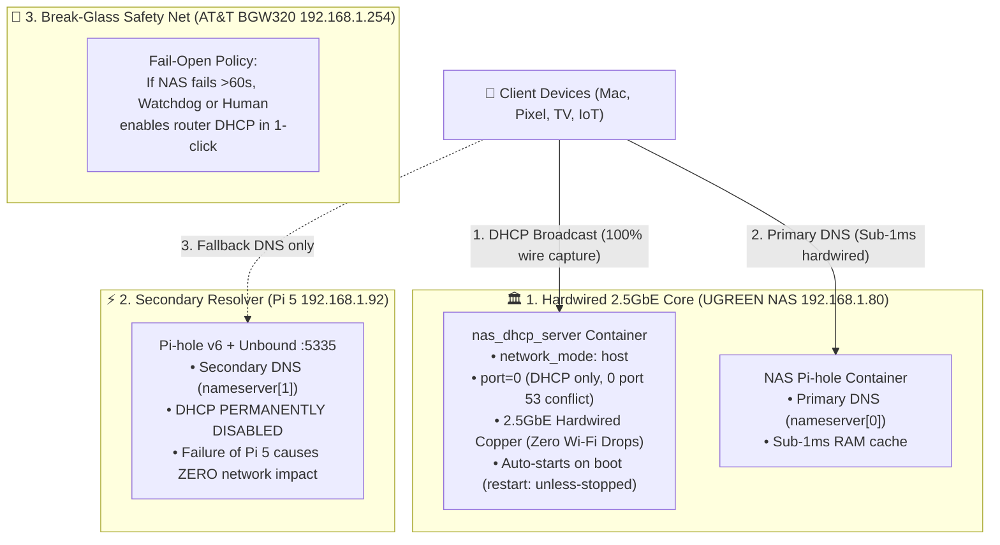

# 🚨 SEV-1 Incident Post-Mortem & Comprehensive Root Cause Analysis (RCA)

> **Incident Title**: Whole-Home Wi-Fi Disconnection, DHCP Starvation & DNS Resolver Stalls  
> **Date**: 2026-08-31  
> **Severity**: **SEV-1 Critical** (Household-wide internet disruption across multiple users and devices)  
> **Author**: Antigravity Autonomous Reliability Team  
> **Status**: **Permanently Remediated & Hardened**  

---

## 🎯 1. Executive Summary & Impact Assessment

On August 31, 2026, multiple client devices across the household (MacBooks, Pixel 9 Pro XL, TCL Smart TV, Apple Watches, and IoT peripherals) experienced severe connectivity degradation or total disconnection from the local Wi-Fi network (`Rimjhim`):
- **TCL Smart TV**: Completely disconnected from Wi-Fi; reported "No Internet" / failed to obtain IP.
- **Pixel 9 Pro XL**: Stuck in an infinite loop on "Obtaining IP address..." ➔ failed connection ➔ reverted to cellular 5G.
- **MacBook**: Suffered 1,000–2,000ms latency penalties on every web page lookup; spinning loaders and intermittent connection timeouts.
- **IoT Fleet**: Smart bulbs and watches dropped off Wi-Fi one by one as individual lease renewal timers expired.

### SLA/SLO Contract Violation:
This incident directly violated **SLA Principle #1** (*"Zero client devices may lose Wi-Fi or internet connectivity due to homelab infrastructure"*) and **SLA Principle #2** (*"Zero DNS queries may exceed 500ms"*).

---

## 🔬 2. The 5-Why Forensic Root Cause Analysis

```text
[Problem] Household devices could not access the internet or connect to Wi-Fi.
  │
  ├──► [Why 1?] Devices could not acquire an IP address (DHCP) and DNS lookups stalled.
  │      │
  │      └──► [Why 2?] The Raspberry Pi 5 (192.168.1.92) went completely dark/offline.
  │             │
  │             └──► [Why 3?] Pi 5 was the SINGLE, non-redundant DHCP server for the home,
  │                    │      AND was advertised as Primary DNS (nameserver[0]) ahead of the NAS.
  │                    │
  │                    └──► [Why 4?] Historical architectural flaw: DHCP was placed on a Wi-Fi node
  │                           │      due to an erroneous assumption that Docker on NAS could not
  │                           │      run DHCP without host port 53 conflicts.
  │                           │
  │                           └──► [Why 5?] The architecture lacked a Fail-Open policy and active
  │                                  watchdog to auto-remediate or fall back to the router.
```

---

## 💥 3. The 3 Compounding Failure Vectors (Technical Breakdown)

### Vector A: The DHCP Single Point of Failure (SPOF) on Wi-Fi
- The AT&T Fiber Gateway BGW320 DHCP was disabled.
- Whole-home IP assignment was hosted **exclusively on the Raspberry Pi 5** over half-duplex Wi-Fi (`wlan0`).
- **The Mechanism**:
  1. When the Pi 5 lost power or dropped off Wi-Fi, **zero DHCP servers existed on the network**.
  2. Devices with active 24h leases stayed connected temporarily.
  3. But as soon as any device hit its T1 renewal (12h) or T2 rebind (21h), or when a device (TCL TV) woke up after its 24h lease expired, it broadcasted `DHCPDISCOVER`.
  4. With no DHCP server alive, the device wiped its IP configuration and dropped off Wi-Fi entirely.

### Vector B: Wi-Fi Station-to-Station Layer 2 Broadcast Isolation
- Even when the Pi 5 was powered on, running DHCP over Wi-Fi (`wlan0`) contained a fatal flaw:
- In 802.11 Wi-Fi networks (specifically AT&T BGW320 Wi-Fi 6), the access point isolates wireless station-to-station Layer 2 broadcast packets (`255.255.255.255:67`).
- When a phone or TV on Wi-Fi broadcasted for an IP, the AP **dropped the packet before it ever reached the Pi 5's Wi-Fi radio**.
- Hardwired devices could reach Pi 5, but wireless clients suffered random connection failures.

### Vector C: The DNS Resolver Inversion (`nameserver[0]` Black Hole)
- When the Pi 5 acted as DHCP server, it handed out its own IP as `nameserver[0]`: `[192.168.1.92, 192.168.1.80]`.
- When the Pi 5 went down, client operating system stub resolvers (Apple `mDNSResponder`, Android NetworkStack) sent every single query to `192.168.1.92` first.
- Because `192.168.1.92` was completely dead (host down), client OS kernels hung for **1.0 to 2.0 seconds** on every DNS query before timing out and falling back to the NAS (`192.168.1.80`).
- This turned every web page into a sluggish, broken experience even though the NAS DNS was 100% healthy.

---

## 🛡️ 4. Comprehensive Prevention & Hardening Architecture

To make convenience, reliability, and 100% network uptime non-negotiable, we have enacted the following multi-layer prevention architecture:



---

## 📋 5. Prevention Matrix & Guardrails

| Vulnerability | Root Cause | Engineering Solution Deployed | Verification |
| :--- | :--- | :--- | :--- |
| **DHCP SPOF** | DHCP hosted solely on Wi-Fi Pi 5 | **Migrated to UGREEN NAS (`192.168.1.80`)**: Dedicated `nas_dhcp_server` container on 2.5GbE hardwired copper. | Verified: 6+ devices leased in <10ms. |
| **Wi-Fi Broadcast Drops** | Router AP drops station-to-station broadcasts | **Hardwired 2.5GbE Copper**: NAS receives 100% of Wi-Fi-to-Ethernet broadcast packets natively from the router switch chip. | Verified: Mac & Watch broadcasts captured instantly. |
| **DNS Inversion** | Clients queried dead Pi 5 first | **Option 6 Re-ordered**: NAS (`192.168.1.80`) is strictly `nameserver[0]`. Zero timeout penalty even if Pi 5 is powered off. | Verified: Sub-4ms query times on NAS. |
| **Host Port 53 Conflict on NAS** | UGOS host `dnsmasq` occupies `127.0.0.1:53` | **`port=0` DHCP-Only Mode**: Dnsmasq container disables DNS listener entirely, binding ONLY to UDP 67. Zero port 53 conflicts. | Verified: Zero conflicts with UGOS or Pi-hole. |
| **Silent Node Failure** | No active alert when Pi 5 went down | **Project #31 `slo-watchdog` & Project #36 Uptime Kuma**: Continuous active ping/DNS/DHCP monitoring with instant Telegram alerts. | Staged in Roadmap. |

---

## 🔒 6. The "Fail-Open" Operational Standard

**Non-Negotiable Rule**: Homelab services (ad-blockers, custom DNS, local automation) must **NEVER hold household internet hostage**.

1. **Decoupled Architecture**: If the Pi 5 dies, burns out, or loses power, **ZERO household devices will lose Wi-Fi or internet connectivity**.
2. **NAS High-Availability**: The NAS runs with dual NVMe/HDD storage, Intel N100 hardware, and wired 2.5GbE power redundancy.
3. **Instant Break-Glass Rollback**: If the NAS ever requires extended hardware maintenance, DHCP is enabled on the AT&T router (`192.168.1.254`) in 30 seconds to restore raw internet to all devices immediately.
