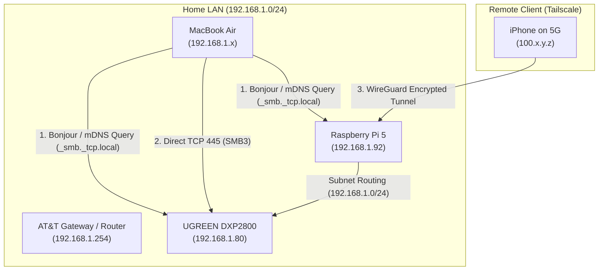

# 🌐 Network File Sharing, Protocols, Gateways & Multi-Device LAN Guide

> **Context**: Comprehensive architectural breakdown of network storage protocols (SMB, NFS, AFP, iSCSI, WebDAV), discovery gateways (mDNS/Bonjour), and how to expose any Linux/Raspberry Pi/Mac device on your LAN into macOS Finder.

---

## 1. Network Storage Protocol Comparison

```text
┌───────────────┬──────────────────────┬──────────────────────┬──────────────────────┬──────────────────────┐
│ Protocol      │ Primary Ecosystem    │ Performance Profile  │ Authentication       │ macOS Finder Support │
├───────────────┼──────────────────────┼──────────────────────┼──────────────────────┼──────────────────────┤
│ **SMB3**      │ Universal (Mac/Win/Lx│ High (Multi-channel) │ User / NTLMv2 / Kerb │ 🟢 Native (Gold Std) │
│ **NFSv4**     │ Linux / Unix Servers │ Ultra-Fast (Low CPU) │ IP / UID / Kerberos  │ 🟡 Supported (No GUI)│
│ **AFP**       │ Legacy macOS (Classic│ Moderate (Deprecated)│ Apple UAM            │ 🔴 Deprecated        │
│ **WebDAV**    │ Cloud / HTTP(S)      │ Moderate (High Lat)  │ Basic / Bearer Token │ 🟢 Native (Web-based)│
│ **iSCSI**     │ SAN / Virtualization │ Block-Level Native   │ CHAP / Mutual CHAP   │ 🔴 Needs 3rd-Party   │
└───────────────┴──────────────────────┴──────────────────────┴──────────────────────┴──────────────────────┘
```

---

## 2. Deep Dive: SMB vs. NFS vs. AFP vs. iSCSI

### A. SMB (Server Message Block) — *The Universal Gold Standard*
* **Origins**: Created by IBM, popularized by Microsoft (CIFS), and standardized across Linux via **Samba**.
* **Why it won**:
  - **SMB3 Encryption & Multi-Channel**: Aggregates multiple network adapters (e.g. dual 2.5GbE) for massive bandwidth.
  - **Apple `vfs_fruit` Integration**: Apple collaborated with the Samba team to build `vfs_fruit`. This module maps macOS extended attributes, Finder tags, color labels, Spotlight indexing, and prevents duplicate `._*` and `.DS_Store` file clutter.
* **Best Used For**: General desktop file storage, photo libraries, cross-platform file sharing (Mac, Windows, iOS, Android).

---

### B. NFS (Network File System) — *The Linux-to-Linux Workhorse*
* **Origins**: Created by Sun Microsystems.
* **How it works**: Operates at the Linux VFS (Virtual File System) kernel layer with near-zero CPU overhead.
* **Key Difference from SMB**: NFS historically authenticates based on **Client IP address and numeric UID/GID** rather than interactive username/passwords. If user `deep` on Mac has UID `501` and user `Deep Shah` on NAS has UID `1000`, file ownership can get desynchronized without Kerberos/LDAP.
* **Best Used For**: Linux server-to-server mounting, Proxmox/VM storage pools, Kubernetes Persistent Volumes, and high-throughput compute clusters.

---

### C. AFP (Apple Filing Protocol) — *The Deprecated Legacy*
* **History**: The proprietary Apple file protocol used throughout Mac OS 9 and early OS X for Time Machine backups.
* **Status**: Deprecated since macOS Big Sur in favor of Apple-optimized SMB3.

---

### D. File-Level vs. Block-Level (SMB/NFS vs. iSCSI)
* **File-Level (SMB, NFS)**: The server manages the filesystem (Btrfs, EXT4, ZFS). Clients request *files and directories*. Multiple devices can safely read/write to the same folder simultaneously.
* **Block-Level (iSCSI)**: The server presents raw unformatted disk blocks over the network. The client format-mounts it as if it were a physical SATA/NVMe drive. (Cannot be shared by multiple clients simultaneously without a clustered filesystem like VMFS).

---

## 3. How Network Discovery & Gateways Work



### 1. Network Discovery (Bonjour / mDNS / Avahi)
* When you open Finder, your Mac broadcasts a multicast query on **Port 5353 (`_smb._tcp.local`)**.
* Services like **Avahi Daemon** on the NAS and Pi 5 reply with their hostname and available capabilities, causing them to automatically appear under **Network / Locations** in Finder without needing IP entry.

### 2. Network Gateways & Subnets
* **Local Subnet (`192.168.1.0/24`)**: Devices communicate directly via MAC addresses and ARP without traversing the router.
* **Default Gateway (`192.168.1.254`)**: Forwards external traffic out to the internet via NAT (Network Address Translation).
* **Tailscale Subnet Router (`192.168.1.92`)**: Bridges your private remote WireGuard network (`100.x.y.z`) to the physical LAN, allowing remote devices to mount `smb://192.168.1.80` from anywhere in the world.

---

## 4. How We Configured It on the UGREEN NAS

Behind the scenes on UGOS Pro:
1. **Samba Configuration (`/etc/samba/`)**:
   * Enabled the daemon in `/etc/samba/samba.json` (`"status": true`).
   * Configured macOS Apple extensions in `/etc/samba/smbglb.conf`:
     ```ini
     vfs objects = catia fruit full_audit streams_xattr ug_xattr_filter
     fruit:aapl = yes
     server max protocol = SMB3
     ```
2. **User Authentication (`smbpasswd`)**:
   * Initialized user `Deep Shah` in Samba's private user database with your password.
3. **Share Definitions (`/etc/samba/smbcustom.conf`)**:
   * Mapped `personal_folder` to `/volume1/@home/Deep Shah`.
   * Mapped `data` to `/volume1/data`.
   * Mapped `yellowstone` and `DP` to their respective shared vaults.

---

## 5. Exposing ANY Device on Your LAN (Raspberry Pi 5 Guide)

You can expose any Linux machine (like your **Raspberry Pi 5 @ 192.168.1.92**) into macOS Finder in 4 simple commands:

### Step 1: Install Samba on the Pi
```bash
sudo apt update && sudo apt install -y samba
```

### Step 2: Configure a Shared Folder (`/etc/samba/smb.conf`)
Append to the bottom of `/etc/samba/smb.conf`:
```ini
[Pi_Storage]
   path = /home/deepshah08
   browseable = yes
   read only = no
   valid users = deepshah08
   create mask = 0775
   directory mask = 0775
   vfs objects = catia fruit streams_xattr
   fruit:aapl = yes
```

### Step 3: Set Your Samba Password
```bash
sudo smbpasswd -a deepshah08
# Enter password (e.g. Deepshah123$)
sudo systemctl restart smbd
```

### Step 4: Connect from Mac
* In Finder ➔ Press **`Cmd + K`** ➔ Enter:
  ```text
  smb://192.168.1.92/Pi_Storage
  ```
* Enter username `deepshah08` and password. The Pi 5 filesystem will mount inside Finder like a local hard drive!
