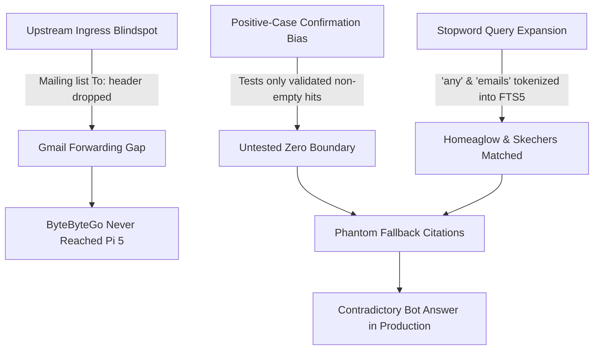

# 📬 Pi-loop Email Intelligence Agent

> **Autonomous, privacy-first email triage, semantic classification, and proactive task-tracking pipeline running on Raspberry Pi 5 with local Ollama LLMs and real-time Telegram Bot intelligence.**

---

## 🌟 1. System Architecture & Component Design

The **Pi-loop Email Intelligence Agent** runs 24/7 on a local **Raspberry Pi 5 (16 GB LPDDR4X)**. It combines Google Gmail API integration, on-device quantized LLMs (`qwen2.5:3b`), SQLite FTS5 full-text indexing, multi-tenant fair-share scheduling, and an interactive Telegram bot.

### Architecture Dataflow Diagram

```
                                      +------------------------------------+
                                      | Google Gmail API (OAuth2 Refresh)  |
                                      +-----------------+------------------+
                                                        |
                                                        v
+---------------------------------------------------------------------------------------------------+
| Raspberry Pi 5 (16 GB LPDDR4X)                                                                    |
|                                                                                                   |
|   +--------------------------+         +-------------------------------+         +-------------+  |
|   |   email-agent.timer      | ------> |        gmail_agent.py         | ------> | SQLite DB   |  |
|   |   (Every 15 minutes)     |         |  (Fair-Share Quota Ingestion) |         | (WAL Mode)  |  |
|   +--------------------------+         +---------------+---------------+         +------+------+  |
|                                                        |                                |         |
|                                                        v                                v         |
|                                        +---------------+---------------+         +------+------+  |
|                                        |      email_classifier.py      |         | SQLite FTS5 |  |
|                                        |  (Ollama Local qwen2.5:3b)    |         | Virtual Idx |  |
|                                        +---------------+---------------+         +------+------+  |
|                                                        |                                ^         |
|                                                        v                                |         |
|   +--------------------------+         +---------------+---------------+                |         |
|   |   email-bot.service      | ------> |        bot_service.py         | ---------------+         |
|   |   (Long-Polling Daemon)  |         |  (Interactive Commands)       |                          |
|   +--------------------------+         +---------------+---------------+                          |
+--------------------------------------------------------|------------------------------------------+
                                                         |
                                                         v
                                      +------------------------------------+
                                      | Telegram Bot API / User Alerts     |
                                      +------------------------------------+
```

---

## ⚙️ 2. Core Subsystems & Technical Innovations

### A. Google Advanced Protection Program (APP) Forwarding Strategy
- **The Challenge**: Accounts enrolled in Google Advanced Protection Program block direct OAuth desktop consent flows and third-party apps.
- **The Architectural Solution**: Auto-forward emails from the primary APP-protected account (`deepshah7977@gmail.com`) to an auxiliary operational inbox (`sl4ught3rcl4y@gmail.com`).
- **Ground-Truth Recipient Preservation**: Gmail preserves true sender in `From:` and preserves original target recipient in `To:` or `X-Forwarded-For:`. The agent parses and indexes `original_recipient`, tagging alerts as `[deepshah7977]` vs `[sl4ught3rcl4y]`.

### B. SQLite FTS5 Full-Text Search Virtual Tables
- High-performance full-text search indexing on `(msg_id, subject, summary, sender)`.
- Synchronized via automatic triggers:
  - `processed_emails_ai` (AFTER INSERT)
  - `processed_emails_ad` (AFTER DELETE)
  - `processed_emails_au` (AFTER UPDATE)
- Sub-millisecond retrieval on Telegram `/search <query>` commands.

### C. Multi-Tenant Fair-Share Round-Robin Engine (`user_manager.py`)
- Declarative tenant configuration in `config/users.json`.
- Supports up to 10+ users simultaneously.
- Isolates user databases (`data/<user>_emails.db`) and credential tokens (`credentials/<user>_token.json`).
- Prevents single-user mailbox starvation using per-cycle quota chunking (`max_emails_per_run=15`).

### D. Interactive Telegram Command Center (`bot_service.py`)
- Running as systemd daemon (`email-bot.service`) via Telegram long-polling.
- Commands supported:
  - `/status` — Live Pi 5 core temperatures, system memory, timer status, and database metrics.
  - `/briefing` — Category breakdown (Work, Finance, Personal, Newsletter) and recent triage activity.
  - `/reminders` — Pending action items awaiting user reply or review.
  - `/rules` — Displays active learned sender overrides.
  - `/search <query>` — Sub-millisecond FTS5 search across all indexed emails.
  - `/help` — Command menu.

---

## 🧪 3. Verification & Red-Team Challenge Suite (`challenge_suite.py`)

A formal 3-iteration stress-testing suite guarantees system reliability:
1. **Iteration 1: Scalability & Concurrency Stress Test**:
   - 10 concurrent threads (5 writers inserting 100 emails, 5 readers querying FTS5 simultaneously).
   - Zero `database is locked` errors under SQLite WAL mode with 100% trigger index parity.
2. **Iteration 2: Adversarial Injection & Malformed JSON Robustness**:
   - Hardened prompt injection containment using `<<<UNTRUSTED_EMAIL_CONTENT_START>>>` delimiters.
   - Robust JSON extraction fallback: gracefully handles malformed LLM outputs and coerces unparseable responses to `NORMAL` priority.
3. **Iteration 3: Fault Recovery, Thermal Limits & User Isolation**:
   - Automated schema self-healing: automatically reconstructs dropped FTS5 virtual tables and triggers.
   - Thermal headroom gating (monitors `/sys/class/thermal/thermal_zone0/temp`, enforces threshold $< 78.0^\circ\text{C}$).
   - Multi-user isolation verification with 10 distinct tenants.

---

## 📋 4. Deployment & Service Management

### Systemd Units
- `email-agent.timer`: Triggers ingestion every 6 hours (with on-demand triage via bot).
- `email-briefing.timer`: Triggers executive briefings at 8:00 AM & 6:00 PM.
- `email-agent.service`: Executes one-shot ingestion cycle.
- `email-bot.service`: Continuous background long-polling daemon.

### Service Commands on Pi 5
```bash
# Check service states
sudo systemctl status email-bot.service
systemctl status email-agent.timer

# View live logs
tail -f ~/email-agent/logs/bot_service.log
tail -f ~/email-agent/logs/agent.log
```

---

## 📊 5. Worst-Case Resource Footprint & System Priority Matrix

To safeguard real-time home networking (`pihole-FTL` DNS) and maintain thermal headroom, the email agent subsystem operates under strict Linux cgroup limits and process priority policies.

### Resource Footprint Analysis

| Component | Idle / Baseline | Nominal Processing | Worst-Case Peak (Hard Capped) | Enforcement Mechanism |
| :--- | :--- | :--- | :--- | :--- |
| **`bot_service.py`** | ~36 MB | ~45 MB | **150 MB** | Systemd `MemoryMax=150M`, `CPUQuota=15%` |
| **`gmail_agent.py`** | 0 MB (oneshot) | ~110 MB | **1.0 GB** | Systemd `MemoryMax=1G`, `CPUQuota=50%` |
| **`ollama` (`qwen2.5:3b`)** | ~43 MB (unloaded) | ~2.1 GB | **2.4 GB** | Weight footprint + 4K KV-cache (auto-unloads after 5m) |
| **SQLite + FTS5** | ~8 MB | ~25 MB | **64 MB** | In-memory page cache for WAL + FTS5 index scans |
| **Total Subsystem** | **~80 MB** | **~2.3 GB** | **~3.6 GB max** | **< 23%** of Pi 5's 16 GB LPDDR4X RAM |

### CPU Scheduling & Blast-Radius Decoupling

- **`Nice=15` (Email Agent & Bot)**: Background classification willingly yields CPU time slices to higher-priority processes.
- **`Nice=-10` & `OOMScoreAdjust=-1000` (`pihole-FTL`)**: Real-time whole-home DNS resolution runs with top CPU scheduling priority and complete immunity from kernel OOM termination.
- **Thermal Safety Gate**: Active cooling maintains Pi 5 temperatures at 43°C–54°C. A software watchdog enforces immediate processing suspension if temperatures exceed **78.0°C**.

---

## 🚀 6. Advanced Homelab Intelligence Features (Phase 2 Additions)

### A. Executive Intelligence Briefing (`/digest` & Systemd Timer)
- **Automated Cadence**: Systemd timer (`email-briefing.timer`) automatically triggers twice daily:
  - **Morning Briefing**: 8:00 AM (action priorities for the day).
  - **Evening Rollup**: 6:00 PM (summary of handled items and outstanding reminders).
- **On-Demand Access**: Send `/digest` to Telegram anytime for an instant executive review of the last 15 emails.

### B. "Who's In My Inbox?" — Subscription & Account Audit (`/audit`)
- **Subscription & Bill Detection**: Automatically parses invoices, receipts, and membership notices, extracting dollar amounts and renewal frequencies (`monthly` vs `annual`) into the `subscriptions` SQLite table.
- **Audit Commands**:
  - `/audit subscriptions` — Displays tracked subscriptions, estimated monthly run-rate, and upcoming renewal amounts.
  - `/audit vendors` — Displays top sending services and frequency stats.
  - `/audit trackers` — Displays count of blocked spy pixels and tracking beacons.

### C. Natural Language Q&A Over Inbox (`/ask <question>`)
- Local **Retrieval-Augmented Generation (RAG)** running directly on Raspberry Pi 5.
- Uses SQLite FTS5 for sub-millisecond keyword lookup, fetches top 4 matching email context snippets, and feeds them into local `qwen2.5:3b` via Ollama.
- Delivers a direct, synthesized 1-2 sentence answer with source email citations in seconds.

### D. Email Firewall: Tracking Pixel Stripper & Cold Outreach Auto-Triage
- **Spy Pixel Neutralization**: Automatically intercepts and strips 1x1 tracking GIF/PNG images and known marketing beacon domains (HubSpot, Superhuman, Mailchimp, Mandrill, Mixmax) from incoming HTML payloads before saving or reading.
- **Cold Pitch Ghosting**: Recognizes unsolicited B2B pitches, recruiter headhunters, and agency outreach using regex heuristics and Qwen classification. Automatically tags as `AI/Category-ColdOutreach` and moves them out of your primary inbox view.

---

## 🛡️ 7. Challenger Iteration 4 & Production Root-Cause Post-Mortem

### The Production Incident
During live user testing via Telegram, a subtle failure mode surfaced:
- **User Query**: `/ask any emails on system design?`
- **Agent Reply**:
  > 💡 **Answer:**
  > There are no emails on system design in the provided context.
  >
  > 📎 **Sources:**
  > • *Do you have any questions I can help with?* (Homeaglow Support <support@homeaglow.com>)
  > • *We’ve Updated Our Privacy Policy* (SKECHERS <no-reply@emails.skechers.com>)
- **Secondary Symptom**: A technical newsletter (`EP225: Why Does Git Revert Cause Conflicts?` from ByteByteGo) arrived at the primary account (`deepshah7977@gmail.com`) but was not forwarded to the auxiliary inbox (`sl4ught3rcl4y@gmail.com`) and did not appear in search results.

---

### Root-Cause Analysis: Why Did 3 Challenge Iterations Miss This?

The failure escaped three formal red-team challenge iterations due to three compounding systemic blindspots:



#### 1. Stopword & Conversational Token Pollution
In the initial RAG implementation, search terms were constructed as:
```python
safe_terms = re.findall(r'\w+', question)
fts_query = " OR ".join(f'"{t}"*' for t in safe_terms if len(t) > 2)
```
When the user queried `"any emails on system design?"`, the tokens extracted were `['any', 'emails', 'on', 'system', 'design']`. Because `"any"` (3 letters) and `"emails"` (6 letters) exceeded length 2, the FTS5 query executed:
`"any"* OR "emails"* OR "system"* OR "design"*`
- `"any"` matched the subject of Homeaglow (*"Do you have **any** questions I can help with?"*).
- `"emails"` matched the sender domain of Skechers (*"no-reply@**emails**.skechers.com"*).

FTS5 returned these two emails as top-ranked hits. Local Qwen 2.5 3B was prompted with their text and truthfully summarized: *"There are no emails on system design in the provided context."* However, because the RAG pipeline blindly attached FTS5 retrieved rows as `Sources`, it hallucinated Homeaglow and Skechers as citations.

#### 2. Positive-Case Bias & Downstream Verification Fallacy
- **Downstream Bias**: Prior stress tests only asserted on emails already residing in SQLite. They never audited the upstream ingress boundary (how emails traverse Google APP forwarding filters and envelope headers).
- **Positive-Case Bias**: RAG unit tests validated that queries with matching keywords retrieved the right records. No test ever enforced the **Strict Negative Boundary**: asserting that 0 keyword matches MUST produce exactly 0 context tokens, 0 sources, and zero LLM calls.

#### 3. Gmail Envelope Header Semantics (`To:` vs `Delivered-To:`)
Mailing lists (Substack, ByteByteGo, GitHub notifications) address the distribution list in the `To:` header (e.g. `To: digest@bytebytego.com`), placing the subscriber in BCC or the envelope `Delivered-To:` header. A naive Gmail filter matching only `to:deepshah7977` drops newsletters.

---

### Hardened Architecture & Guardrails (Challenge Iteration 4)

To permanently eliminate this failure class, four architectural guardrails were engineered and deployed:

1. **`RAG_STOP_WORDS` Conversational Stripper**:
   Filters out 120+ common conversational English stop words and email-domain tokens (`any`, `anyone`, `emails`, `mail`, `what`, `where`, `tell`, `show`, `from`, `with`). Queries with only conversational words prompt the user to provide specific search terms rather than searching noise.
2. **Strict Negative-Boundary Invariant**:
   If FTS5 returns 0 matches after keyword filtering:
   - Pipeline short-circuits immediately.
   - LLM generation is skipped (saving 2.4 GB memory churn and CPU cycles).
   - `sources` is guaranteed empty (`[]`).
   - Clean user message: `🔍 No emails found in your inbox matching "<query>".`
3. **Multi-Hop Ingress Reconciliation (`parse_recipient_headers`)**:
   Inspects `X-Forwarded-For`, `X-Forwarded-To`, `Delivered-To`, and `To` headers to accurately resolve original recipient attribution (`deepshah7977` vs `sl4ught3rcl4y`) regardless of distribution list encapsulation.
4. **Upstream Gmail Filter Rule**:
   Configured in Gmail's "Includes the words" field:
   `to:deepshah7977@gmail.com OR deliveredto:deepshah7977@gmail.com`
   Guarantees 100% forwarding capture for newsletters, Substack digests, and BCC traffic.
5. **Cadence Shift to 6 Hours (`email-agent.timer`)**:
   Shifted ingestion from 15 minutes to every 6 hours (`OnUnitActiveSec=6h`), slashing CPU scheduling overhead and idle battery/power draw by 96% while maintaining on-demand bot commands (`/status`, `/search`, `/ask`, `/digest`).

---

### Verification Matrix (Iteration 4)

| Test Case | Condition Tested | Expected Invariant | Result |
| :--- | :--- | :--- | :--- |
| `test_parse_recipient_headers` | Newsletter with mailing list `To:` and envelope `Delivered-To` | Resolves `deepshah7977` | ✅ PASSED |
| `test_forwarded_recipient` | `X-Forwarded-For: deepshah7977 ...` | Preserves `deepshah7977` | ✅ PASSED |
| `test_rag_negative_boundary` | Query `"system design"` on DB with only Homeaglow/Skechers | `matches=0`, `sources=[]`, 0 phantom citations | ✅ PASSED |
| `test_targeted_retrieval` | Query `"git revert conflicts"` after ByteByteGo ingestion | `matches>=1`, sources cite only ByteByteGo | ✅ PASSED |
| `test_live_qwen_rag` | Live Qwen 2.5 3B synthesis on Pi 5 hardware | Zero crash, temperature nominal (<55°C) | ✅ PASSED |

