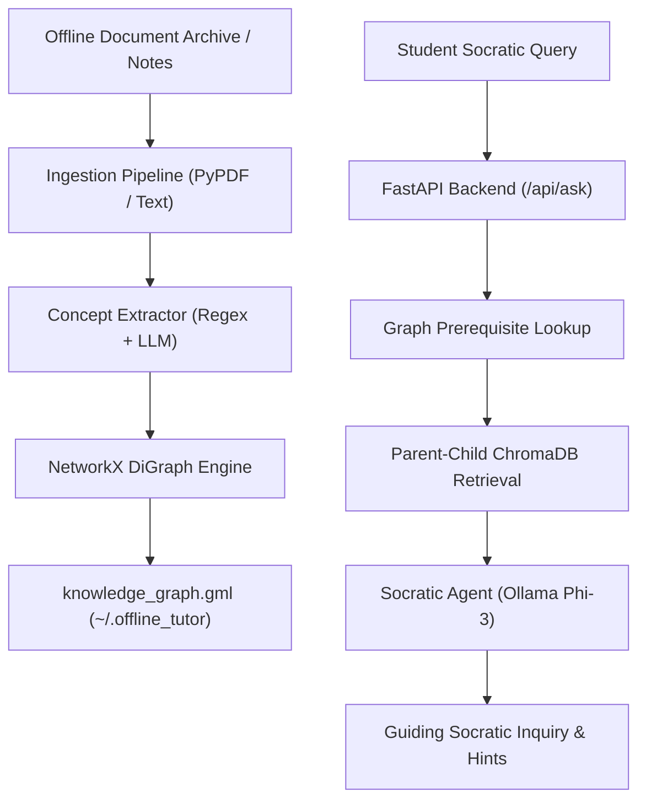

# 📚 Project 01: Offline Socratic Tutor (Raspberry Pi 5)

> **Context**: GraphRAG-powered autonomous tutoring engine leveraging NetworkX prerequisite knowledge graphs and local LLM guidance (Ollama Phi-3) running fully offline on Raspberry Pi 5.  
> **Status**: 🟢 **Production / Tested**  
> **Host**: Raspberry Pi 5 (`192.168.1.92`)  
> **Repository**: [`deepshah08/raspberry-pi-5-ecosystem/projects/01-offline-tutor`](https://github.com/deepshah08/raspberry-pi-5-ecosystem/tree/main/projects/01-offline-tutor)  

---

## 1. Architecture Overview

## 2. Key Components

- **Graph Engine (`graph_engine.py`)**: Manages directional dependency graph (`prerequisite -> concept`) and calculates topological learning paths using `networkx.topological_sort`.
- **Concept Extractor (`concept_extractor.py`)**: Extracts concept-prerequisite pairs using local Ollama model with deterministic regex rule fallbacks.
- **Socratic Agent (`agent.py`)**: Formulates concise, pedagogical questions instead of direct answers to foster critical thinking.
- **Curriculum Builder (`curriculum_builder.py`)**: Synthesizes structured markdown learning syllabi from graph paths.

## 3. Verified Functionality & Test Suite

- `projects/01-offline-tutor/tests/test_graph.py`: Validates graph creation, node/edge serialization, and learning path extraction.
- `projects/01-offline-tutor/tests/test_tutor.py`: Validates concept extraction rules, prerequisite traversal, and Socratic response fallback.
- **Test Results**: 4/4 passing tests.
