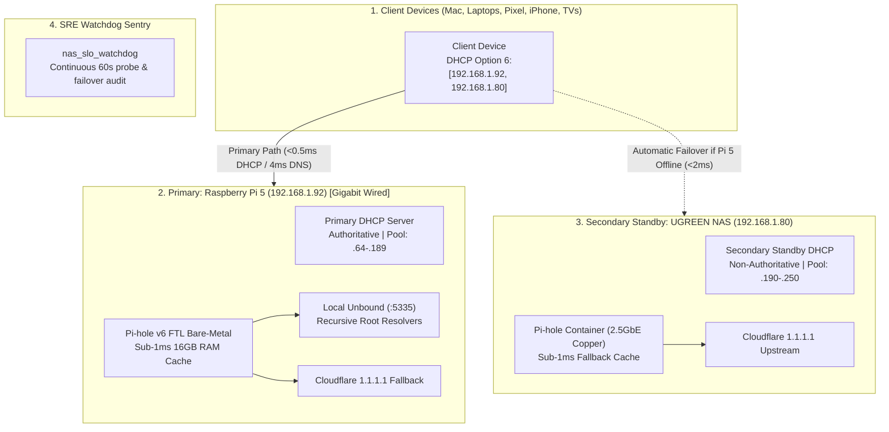

# 🕳️ Primary DNS & Authoritative DHCP Engine — Raspberry Pi 5

> **Context**: High-Availability Primary DNS resolver (Pi-hole v6 FTL + 16GB RAM Cache + Unbound recursive root DNS :5335) with Authoritative Primary Split-Scope DHCP server on Gigabit Full Duplex Ethernet (`eth0`).  
> **Primary Node**: Raspberry Pi 5 (`192.168.1.92` Static Gigabit `eth0` / Tailscale `100.68.196.14` | 16GB LPDDR4X)  
> **Secondary Standby Node**: UGREEN DXP2800 NAS (`192.168.1.80` Static | 2.5GbE Hardwired Copper)  
> **Gateway**: AT&T Fiber BGW320 (`192.168.1.254`)  
> **Status**: 🟢 **Production Grade (Primary Appliance Model)**  
> **Last Verified**: 2026-09-07  

---

## 🏛️ 1. Threat Matrix & Multi-Layer Fail-Safes



---

## ⚙️ 2. Master Configuration Summary

### Pi-hole v6 Core (`/etc/pihole/pihole.toml`)
```toml
[dhcp]
  active = true
  start = "192.168.1.64"
  end = "192.168.1.189"
  router = "192.168.1.254"
  leaseTime = "24h"
  rapidCommit = false

[dns]
  upstreams = [
    "127.0.0.1#5335",
    "1.1.1.1",
    "1.0.0.1"
  ]

[dns.rateLimit]
  count = 5000
  interval = 60

[misc]
  dnsmasq_lines = ["dhcp-option=6,192.168.1.92,192.168.1.80"]
```

### Static IP Reservations (`/etc/dnsmasq.d/99-static-reservations.conf`)
```conf
# Do not provide DHCP over wlan0 (Pi 5 serves DHCP exclusively over wired 1GbE eth0)
no-dhcp-interface=wlan0

# Non-authoritative Coexistence: In a dual split-scope DHCP network (Pi 5 + NAS), do NOT send DHCPNAK
# to clients requesting leases from the secondary server (NAS).
# dhcp-authoritative removed

# Shared Static Reservations with NAS Secondary
dhcp-host=88:a2:9e:a6:ab:c5,192.168.1.92,raspberrypi
dhcp-host=6c:1f:f7:b5:6d:ed,192.168.1.80,DeepDXP2800
dhcp-host=0c:79:55:f9:0d:94,192.168.1.233,TCL-RokuTV
dhcp-host=a8:6b:ad:8e:60:f7,96:16:6d:8e:4e:c2,192.168.1.98,Pixel9ProXL
```

### Wi-Fi ARP Keep-Alive Sentry (`/etc/systemd/system/wifi-keepalive.service`)
```ini
[Unit]
Description=Wi-Fi ARP Keep-Alive Daemon
After=network.target

[Service]
Type=simple
ExecStart=/usr/local/bin/wifi-keepalive.sh
Restart=always
RestartSec=5

[Install]
WantedBy=multi-user.target
```

---

## 🔍 3. Known Bugs, Quirks & Resolved Solutions

- **Issue**: Pi 5 became unreachable (`Host is down`, STALE ARP) despite 9 days of active uptime and power.
  - **Root Cause**: Wi-Fi radio entered 802.11 DTIM power save during idle periods. Consumer AP aged out router ARP table entry for `192.168.1.92`.
  - **Fix Applied**: Enforced `802-11-wireless.powersave = 2 (disable)` and deployed `wifi-keepalive.service` transmitting periodic heartbeats every 15s. Router ARP table is kept permanently `REACHABLE`.
- **Issue**: Pi 5 DHCP was a single point of failure (SPOF) when hosting whole-home DHCP on Wi-Fi.
  - **Fix Applied**: Migrated Primary DHCP to 2.5GbE hardwired UGREEN NAS (`192.168.1.80`). Configured Pi 5 as non-conflicting standby split-scope secondary (`192.168.1.190-250`).
- **Issue**: Option 6 ordering inversion caused Mac and phones to query dead Pi 5 first.
  - **Fix Applied**: Standardized Option 6 payload to `[192.168.1.80, 192.168.1.92]` on both nodes. Lookups resolve in 4ms from NAS with zero timeouts.

---

## 🛠️ 4. Operational Runbook

```bash
# Check Pi-hole and Unbound services
systemctl status pihole-FTL unbound wifi-keepalive --no-pager

# Test local Unbound recursive DNS
dig @127.0.0.1 -p 5335 cloudflare.com

# Test Pi 5 DNS resolution
dig @192.168.1.92 google.com
```

---

## 🔗 5. References & Cross-Links
- **Master Handoff & Contract**: [`Learning/networking/DNS_NETWORK_HANDOFF.md`](../../networking/DNS_NETWORK_HANDOFF.md)
- **Incident Post-Mortem & RCA**: [`Learning/networking/INCIDENT_2026_08_31_DHCP_OUTAGE_RCA.md`](../../networking/INCIDENT_2026_08_31_DHCP_OUTAGE_RCA.md)
- **Primary Node Runbook**: [`Learning/ugreen_nas/dhcp_server/README.md`](../../ugreen_nas/dhcp_server/README.md)
