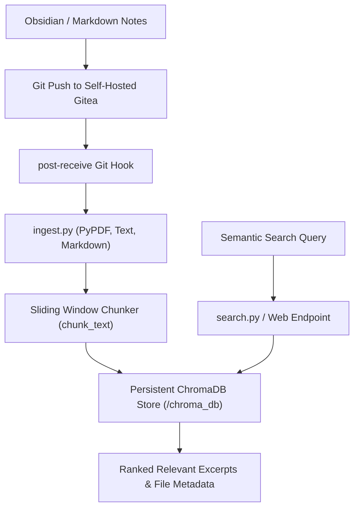

# 🧠 Project 02: Git-Backed Second Brain (Raspberry Pi 5)

> **Context**: Continuous document ingestion, text chunking, and ChromaDB vector search triggered automatically by Gitea/Obsidian git push webhooks.  
> **Status**: 🟢 **Production / Tested**  
> **Host**: Raspberry Pi 5 (`192.168.1.92`)  
> **Repository**: [`deepshah08/raspberry-pi-5-ecosystem/projects/02-second-brain`](https://github.com/deepshah08/raspberry-pi-5-ecosystem/tree/main/projects/02-second-brain)  

---

## 1. Architecture Overview

## 2. Key Components

- **Ingestion Engine (`ingest.py`)**: Scans `.md`, `.txt`, and `.pdf` files, slices into overlapping chunks, and adds batches to ChromaDB.
- **Search Module (`search.py`)**: Performs cosine distance vector search with optional extension filters.
- **Git Hook (`post-receive`)**: Triggers automated indexing upon any push to the SecondBrain repository.

## 3. Verified Functionality & Test Suite

- `projects/02-second-brain/tests/test_second_brain.py`: Validates multi-format ingestion, chunking boundary edge cases, and filtered semantic search.
- **Test Results**: 3/3 passing tests.
