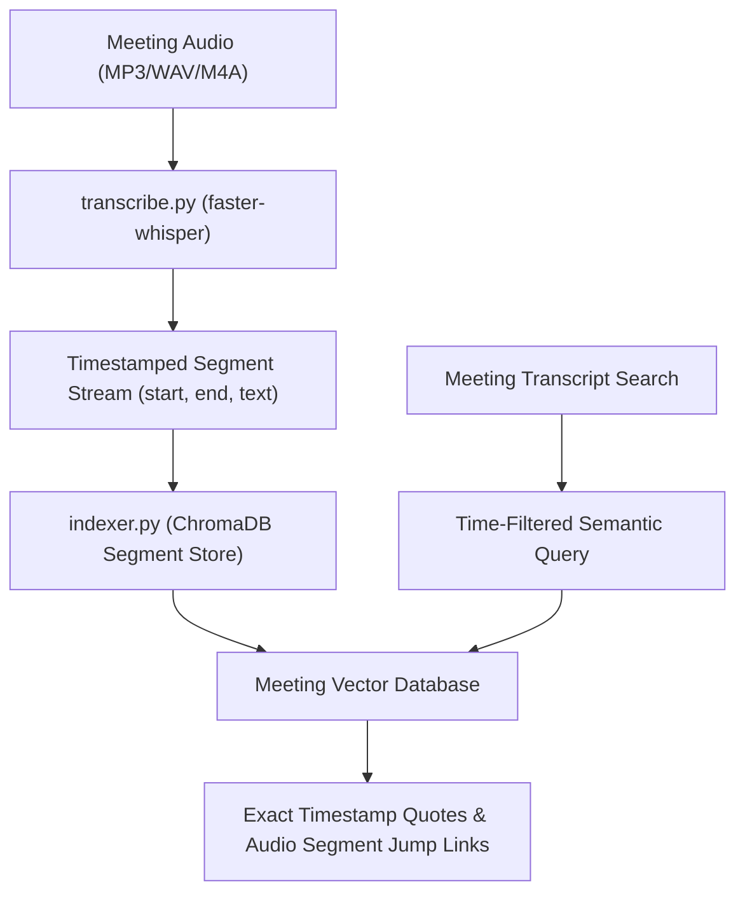

# 🎙️ Project 03: WhisperX Meeting Indexer (Raspberry Pi 5)

> **Context**: High-performance local audio transcription with faster-whisper and timestamped segment vector indexing in ChromaDB for meeting archives.  
> **Status**: 🟢 **Production / Tested**  
> **Host**: Raspberry Pi 5 (`192.168.1.92`)  
> **Repository**: [`deepshah08/raspberry-pi-5-ecosystem/projects/03-whisper-indexer`](https://github.com/deepshah08/raspberry-pi-5-ecosystem/tree/main/projects/03-whisper-indexer)  

---

## 1. Architecture Overview

## 2. Key Components

- **Audio Transcriber (`transcribe.py`)**: Efficient CPU-based `faster-whisper` inference with INT8 quantization on ARM64.
- **Segment Indexer (`indexer.py`)**: Ingests timestamped segments and provides time-window filtered vector queries.
- **Service Timer (`whisper-indexer.service / .timer`)**: Systemd automation monitoring incoming meeting recordings.

## 3. Verified Functionality & Test Suite

- `projects/03-whisper-indexer/tests/test_whisper_indexer.py`: Validates audio transcription parser, segment indexing, and combined start/end timestamp filtering.
- **Test Results**: 5/5 passing tests.
