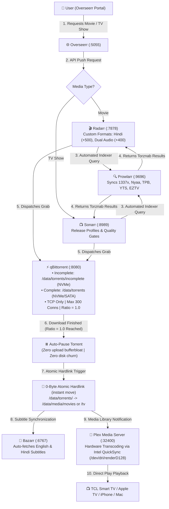

# 🎬 Media & *Arr Stack Handoff Document

> **Domain**: Media Automation, Ingestion Pipeline & High-Performance Storage Architecture  
> **Host Node**: UGREEN DXP2800 NAS (`192.168.1.80` | Intel N100, 8GB DDR5, 2.5GbE Wired Ethernet)  
> **Operating System**: UGOS Pro (Debian 12 Kernel)  
> **Status**: 🟢 **Production Healthy & Hardened (Zero NAT Flood / Ratio 1.0 Auto-Pause)**

---

## 🏗️ 1. Physical Hardware & Storage Tiering

```text
┌─────────────────────────────────────────────────────────────────────────────────────────────┐
│                                STORAGE TIERING ARCHITECTURE                                 │
├──────────────────────────┬─────────────────────────────┬────────────────────────────────────┤
│ Storage Tier             │ Physical Hardware           │ Role & Filesystem                  │
├──────────────────────────┼─────────────────────────────┼────────────────────────────────────┤
│ 🚀 Tier 1: Hot App Tier   │ 4TB WD_BLACK SN850X (NVMe)  │ `/volume2/@docker` + `/volume2/docker` │
│                          │ PCIe 4.0 (7,300 MB/s read)  │ Docker Engine, SQLite DBs (*Arr),  │
│                          │ 2,400 TBW Lifespan          │ Incomplete Torrents, Transcode RAM │
├──────────────────────────┼─────────────────────────────┼────────────────────────────────────┤
│ ❄️ Tier 2: Cold Media Tier│ 10TB Seagate IronWolf (CMR) │ `/volume1/data/media/`             │
│                          │ SATA 6Gb/s (Btrfs Pool)     │ Movies, TV Series, Deep Storage    │
│                          │ Spindown / Hibernation Ready│ 0-Byte Atomic Hardlinks from /data/│
├──────────────────────────┼─────────────────────────────┼────────────────────────────────────┤
│ 🛑 Tier 3: Archival Standby│ 8TB Seagate Expansion (SMR) │ External USB 3.0 (Disconnected)    │
│                          │ 15-Minute Spindown Rules    │ Cold Restic/Borg Encrypted Backups │
└──────────────────────────┴─────────────────────────────┴────────────────────────────────────┘
```

---

## 🔄 2. End-to-End Media Ingestion Flow (From Request to Playback)



---

## 🛡️ 3. Hardened BitTorrent Configuration (Anti-Bufferbloat & NAT Table Protection)

To prevent BitTorrent from ever saturating the router's NAT state table or degrading household Wi-Fi latency, the following parameters are actively enforced in `/volume2/docker/arr_stack/qbittorrent/qBittorrent/qBittorrent.conf`:

```ini
[BitTorrent]
# 1. Connection Limits (Caps router NAT table usage to <4.9%)
Session\MaxConnections=300
Session\MaxConnectionsPerTorrent=50
Session\MaxHalfOpenConnections=50
Session\MaxUploads=20
Session\MaxUploadsPerTorrent=5

# 2. Seed Ratio Limiter (Net-Zero Parity + HDD Protection)
Session\GlobalMaxRatioEnabled=true
Session\GlobalMaxRatio=1.0
Session\GlobalMaxRatioAction=0       # 0 = Automatically PAUSE torrent upon reaching 1:1 ratio

# 3. Path Structure (Enables Atomic Instant Hardlinks)
Session\DefaultSavePath=/data/torrents
Session\TempPath=/data/torrents/incomplete
```

### Why Ratio = 1.0 Auto-Pause is Critical:
1. **Net-Zero Swarm Parity**: Uploads the exact amount downloaded (1:1), maintaining good torrent citizenship without unbounded bandwidth usage.
2. **Protects 10TB Mechanical HDD**: Stops continuous random actuator read sweeps on the Seagate IronWolf CMR drive, allowing it to spin down and run cool.
3. **Frees Router NAT Memory**: Closes peer tracking states immediately upon completion.
4. **Zero Impact on Plex**: The hardlink in `/data/media/` remains 100% playable on Plex forever.

---

## 🚀 4. Live Container Stack & Port Map

| Service | Port | Local Endpoint | Health & Capability |
| :--- | :--- | :--- | :--- |
| **Plex Media Server** | `32400` | [http://192.168.1.80:32400/web](http://192.168.1.80:32400/web) | 🟢 Intel QuickSync (`/dev/dri/renderD128`) hardware 4K HDR transcoding |
| **Prowlarr** | `9696` | [http://192.168.1.80:9696](http://192.168.1.80:9696) | 🟢 Automated indexer manager syncing to Radarr/Sonarr |
| **Radarr** | `7878` | [http://192.168.1.80:7878](http://192.168.1.80:7878) | 🟢 Movie management with custom formats |
| **Sonarr** | `8989` | [http://192.168.1.80:8989](http://192.168.1.80:8989) | 🟢 TV show season packs and release profiles |
| **qBittorrent** | `8080` | [http://192.168.1.80:8080](http://192.168.1.80:8080) | 🟢 Download client (Port `6881` P2P, user `admin`) |
| **Bazarr** | `6767` | [http://192.168.1.80:6767](http://192.168.1.80:6767) | 🟢 Subtitle synchronization |
| **Overseerr** | `5055` | [http://192.168.1.80:5055](http://192.168.1.80:5055) | 🟢 Media discovery & request dashboard |
| **Tautulli** | `8181` | [http://192.168.1.80:8181](http://192.168.1.80:8181) | 🟢 Plex stream telemetry & GPU monitoring |

---

## 🛠️ 5. Operational Maintenance Commands

### Restarting the Media Stack:
```bash
ssh nas "echo 'S#@#j0k3R' | sudo -S bash -c 'cd /volume2/docker/arr_stack && docker compose restart'"
```

### Checking Active Torrents and Ratio via API:
```bash
ssh nas "python3 -c \"
import urllib.request, urllib.parse, json
login_url = 'http://192.168.1.80:8080/api/v2/auth/login'
data = urllib.parse.urlencode({'username': 'admin', 'password': 'Deepshah123$'}).encode()
req = urllib.request.Request(login_url, data=data)
cookie = urllib.request.urlopen(req).headers.get('Set-Cookie')

info_url = 'http://192.168.1.80:8080/api/v2/torrents/info'
req = urllib.request.Request(info_url, headers={'Cookie': cookie})
torrents = json.loads(urllib.request.urlopen(req).read().decode())
print(f'Total Torrents: {len(torrents)}')
for t in torrents:
    print(f\\\"- {t['name']}: State={t['state']}, Ratio={t['ratio']:.2f}, Progress={t['progress']*100:.1f}%\\\")
\""
```
