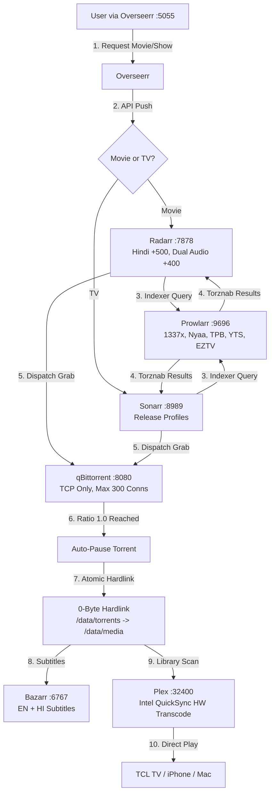

# 🎬 Media & *Arr Stack — Handoff & SLA/SLO Contract

> **Domain**: Media Automation, Ingestion Pipeline & High-Performance Storage Architecture  
> **Host Node**: UGREEN DXP2800 NAS (`192.168.1.80` | Intel N100, 8GB DDR5, 2.5GbE Wired Ethernet)  
> **Operating System**: UGOS Pro (Debian 12 Kernel)  
> **Status**: 🟢 **Production Healthy & Hardened**  
> **Last Verified**: 2026-08-29  
> **SLO Enforcement**: Strict — Any violation is a **SEV-2 Incident** requiring immediate remediation.

---

## 📋 Table of Contents

1. [Physical Hardware & Storage Tiering](#-1-physical-hardware--storage-tiering)
2. [End-to-End Media Ingestion Flow](#-2-end-to-end-media-ingestion-flow)
3. [Hardened BitTorrent Configuration](#-3-hardened-bittorrent-configuration)
4. [Live Container Stack & Port Map](#-4-live-container-stack--port-map)
5. [Service Level Agreement (SLA)](#-5-service-level-agreement-sla)
6. [Service Level Objectives (SLO) per Service](#-6-service-level-objectives-slo-per-service)
7. [Incident Classification & Escalation Matrix](#-7-incident-classification--escalation-matrix)
8. [Operational Maintenance Commands](#-8-operational-maintenance-commands)
9. [Design Decisions & Rationale Log](#-9-design-decisions--rationale-log)

---

## 🏗️ 1. Physical Hardware & Storage Tiering

| Storage Tier | Physical Hardware | Role & Filesystem |
| :--- | :--- | :--- |
| **Tier 1: Hot App** | 4TB WD_BLACK SN850X NVMe PCIe 4.0 (7,300 MB/s, 2,400 TBW) | `/volume2/@docker` — Docker Engine, SQLite DBs, Incomplete Torrents |
| **Tier 2: Cold Media** | 10TB Seagate IronWolf CMR SATA 6Gb/s (Btrfs, Spindown) | `/volume1/data/media/` — Movies, TV, Deep Storage (0-Byte Atomic Hardlinks) |
| **Tier 3: Archival** | 8TB Seagate Expansion SMR (External USB 3.0, Cold) | Disconnected / Cold Encrypted Backups |


---

## 🔄 2. End-to-End Media Ingestion Flow



### Hardlink Mechanics:
1. qBittorrent downloads to `/data/torrents/movies/` (NVMe for incomplete, SATA for complete).
2. Radarr/Sonarr creates a **0-byte atomic hardlink** at `/data/media/movies/` or `/data/media/tv/`.
3. Plex streams the file with **zero duplicate disk space** and **zero additional SSD wear**.
4. Original torrent file remains seeded until Ratio = 1.0, then auto-pauses.

---

## 🛡️ 3. Hardened BitTorrent Configuration

Active in `/volume2/docker/arr_stack/qbittorrent/qBittorrent/qBittorrent.conf`:

```ini
[BitTorrent]
Session\MaxConnections=300
Session\MaxConnectionsPerTorrent=50
Session\MaxHalfOpenConnections=50
Session\MaxUploads=20
Session\MaxUploadsPerTorrent=5
Session\GlobalMaxRatioEnabled=true
Session\GlobalMaxRatio=1.0
Session\GlobalMaxRatioAction=0
Session\DefaultSavePath=/data/torrents
Session\TempPath=/data/torrents/incomplete
```

| Parameter | Value | Rationale |
| :--- | :--- | :--- |
| `MaxConnections` | `300` | Caps router NAT table usage to <4.9% of BGW320 8,192-entry capacity |
| `GlobalMaxRatio` | `1.0` | Net-zero swarm parity; auto-pauses at 1:1 to protect HDD and free NAT slots |
| `GlobalMaxRatioAction` | `0` (Pause) | Prevents unbounded upload bandwidth consumption and mechanical HDD churn |
| `DefaultSavePath` | `/data/torrents` | Unified mount enables atomic hardlinks across containers |

---

## 🚀 4. Live Container Stack & Port Map

| Service | Port | Endpoint | Health |
| :--- | :--- | :--- | :--- |
| **Plex Media Server** | `32400` | `http://192.168.1.80:32400/web` | 🟢 QuickSync 4K HDR |
| **Prowlarr** | `9696` | `http://192.168.1.80:9696` | 🟢 Indexer Sync |
| **Radarr** | `7878` | `http://192.168.1.80:7878` | 🟢 Movie Automation |
| **Sonarr** | `8989` | `http://192.168.1.80:8989` | 🟢 TV Automation |
| **qBittorrent** | `8080` | `http://192.168.1.80:8080` | 🟢 P2P Port 6881 |
| **Bazarr** | `6767` | `http://192.168.1.80:6767` | 🟢 Subtitle Sync |
| **Overseerr** | `5055` | `http://192.168.1.80:5055` | 🟢 Request Portal |
| **Tautulli** | `8181` | `http://192.168.1.80:8181` | 🟢 Stream Telemetry |

---

## 📜 5. Service Level Agreement (SLA)

> **Scope**: This SLA governs the operational reliability of the complete Media & *Arr automation stack running on the UGREEN DXP2800 NAS.  
> **Accountability**: Any SLO violation caused by the media stack infrastructure (not upstream ISP or physical power failure) is classified as an **Incident** requiring immediate priority remediation.  
> **Enforcement**: A monitoring daemon (`slo-watchdog`) continuously validates all objectives and auto-invokes remediation agents upon breach detection.

### SLA Principles:
1. **The media stack must NEVER degrade whole-home network availability.** BitTorrent activity, container restarts, or storage I/O must not cause DNS latency spikes, Wi-Fi drops, or router NAT exhaustion.
2. **Media playback must be uninterrupted.** Once a title is hardlinked to `/data/media/`, Plex playback must succeed without buffering under normal LAN conditions.
3. **Automation must be silent and self-healing.** Radarr/Sonarr/Prowlarr must not require manual intervention for standard grab-import-rename-subtitle workflows.
4. **Storage integrity is non-negotiable.** Btrfs scrubs, SMART monitoring, and NVMe wear tracking must be active. Data loss of any imported media file is a SEV-1.

---

## 📊 6. Service Level Objectives (SLO) per Service

### 6.1 Plex Media Server

| SLO Metric | Target | Breach Threshold | Severity |
| :--- | :--- | :--- | :--- |
| **Availability** | 99.9% uptime (≤43 min downtime/month) | Container down >5 min without auto-restart | **SEV-2** |
| **Playback Start Latency** | <3 seconds to first frame (Direct Play) | >5 seconds to first frame on LAN | **SEV-3** |
| **Transcode Success Rate** | 100% for QuickSync-supported codecs | Any failed transcode due to `/dev/dri` unmapped | **SEV-2** |
| **Library Sync Freshness** | New media detected within 5 min of hardlink | >15 min delay between import and Plex visibility | **SEV-3** |

### 6.2 Radarr / Sonarr (Media Management)

| SLO Metric | Target | Breach Threshold | Severity |
| :--- | :--- | :--- | :--- |
| **Availability** | 99.9% uptime | Container CrashLoopBackOff or port unreachable >5 min | **SEV-2** |
| **Grab-to-Import Latency** | <5 min after qBittorrent completion | Torrent stuck in "Completed" without hardlink >30 min | **SEV-3** |
| **Hardlink Success Rate** | 100% (zero copy operations) | Any `cp` instead of hardlink (detected by inode mismatch) | **SEV-2** |
| **SQLite DB Integrity** | Zero corruption events | `SQLITE_CORRUPT` or `SQLITE_BUSY` in container logs | **SEV-1** |

### 6.3 qBittorrent (Download Client)

| SLO Metric | Target | Breach Threshold | Severity |
| :--- | :--- | :--- | :--- |
| **NAT Table Footprint** | <5% of router capacity (<400 entries) | >1,000 active NAT states attributed to qBittorrent | **SEV-1** |
| **Seed Ratio Enforcement** | 100% compliance with Ratio ≤ 1.0 | Any torrent seeding beyond 1.05 ratio | **SEV-3** |
| **Network Collateral Damage** | Zero Wi-Fi/DNS degradation during downloads | DNS P95 latency >50ms correlated with active torrents | **SEV-1** |
| **Config Drift** | Zero unauthorized parameter changes | `MaxConnections`, `GlobalMaxRatio` differ from baseline | **SEV-2** |

### 6.4 Prowlarr (Indexer Hub)

| SLO Metric | Target | Breach Threshold | Severity |
| :--- | :--- | :--- | :--- |
| **Availability** | 99.5% uptime | Unreachable >15 min | **SEV-3** |
| **Indexer Sync Health** | ≥3 healthy indexers at all times | <2 indexers returning results | **SEV-3** |

### 6.5 Bazarr (Subtitle Automation)

| SLO Metric | Target | Breach Threshold | Severity |
| :--- | :--- | :--- | :--- |
| **Availability** | 99.5% uptime | Unreachable >15 min | **SEV-3** |
| **Subtitle Match Rate** | >90% for English; >70% for Hindi | <50% match rate across library | **SEV-3** |

### 6.6 Storage & Disk Health

| SLO Metric | Target | Breach Threshold | Severity |
| :--- | :--- | :--- | :--- |
| **NVMe Wear Level** | <1% TBW consumed per year | >5% annual TBW consumption rate | **SEV-2** |
| **Btrfs Scrub Errors** | Zero uncorrectable errors | Any `csum` or metadata error detected | **SEV-1** |
| **HDD SMART Health** | Zero reallocated sectors | `Reallocated_Sector_Ct` > 0 or `Current_Pending_Sector` > 0 | **SEV-1** |
| **Free Space (NVMe)** | >500 GB free on `/volume2` | <200 GB remaining | **SEV-2** |
| **Free Space (HDD)** | >1 TB free on `/volume1` | <500 GB remaining | **SEV-3** |

---

## 🚨 7. Incident Classification & Escalation Matrix

| Severity | Definition | Response Time | Remediation Target |
| :--- | :--- | :--- | :--- |
| **SEV-1** | Data loss, disk failure, network-wide collateral damage | Immediate (auto-alert) | <15 minutes |
| **SEV-2** | Service down >5 min, config drift, hardlink failure, transcode fail | <5 minutes (auto-detect) | <30 minutes |
| **SEV-3** | Degraded performance, subtitle miss, slow import, indexer flap | <15 minutes | <2 hours |


### Escalation Protocol:
1. **Auto-Detection**: `slo-watchdog` daemon polls service health endpoints, container states, disk SMART, and NAT table counts.
2. **Auto-Remediation (SEV-2/3)**: Daemon attempts `docker restart <service>` and verifies recovery.
3. **Agent Invocation (SEV-1/2 persistent)**: If auto-restart fails after 2 attempts, daemon invokes an AI agent session with the relevant handoff document context to diagnose root cause.
4. **Human Escalation (SEV-1 unresolved)**: Alert pushed to Telegram bot + n8n webhook if unresolved after 15 minutes.

---

## 🛠️ 8. Operational Maintenance Commands

### Restart Full Media Stack:
```bash
ssh nas "cd /volume2/docker/arr_stack && sudo docker compose restart"
```

### Health Check All Services (Quick Probe):
```bash
ssh nas "for port in 32400 9696 7878 8989 8080 6767 5055 8181; do \
  code=$(curl -s -o /dev/null -w '%{http_code}' --connect-timeout 3 http://localhost:\$port); \
  echo \"Port \$port: HTTP \$code\"; done"
```

### Check qBittorrent NAT Footprint:
```bash
ssh nas "sudo conntrack -L 2>/dev/null | grep -c ':8080\|:6881' || echo 'conntrack not available'"
```

### Verify Hardlink Integrity (No Copies):
```bash
ssh nas "find /volume1/data/media -type f -links 1 -name '*.mkv' -o -name '*.mp4' | head -20"
```
If output is non-empty, files exist without hardlinks (potential SLO breach).

### SMART Health Check:
```bash
ssh nas "sudo smartctl -H /dev/sda && sudo smartctl -H /dev/nvme0"
```

---

## 📝 9. Design Decisions & Rationale Log

| Decision | Rationale | Date |
| :--- | :--- | :--- |
| **Ratio = 1.0 Auto-Pause** | Net-zero swarm parity. Prevents unbounded upload, protects CMR HDD actuator from continuous random reads, and immediately frees router NAT table entries. | 2026-08-28 |
| **TCP-Only BitTorrent (`BittorrentProtocol=1`)** | Eliminates connectionless uTP UDP state multiplication in router `conntrack` tables. UDP probes linger 30-120s without teardown handshakes. TCP uses deterministic FIN/RST for instant state cleanup. | 2026-08-28 |
| **MaxConnections = 300** | Caps NAT table usage to <4.9% of BGW320 8,192-entry hardware capacity. Preserves full gigabit throughput while leaving >95% NAT headroom for household devices. | 2026-08-28 |
| **Atomic Hardlinks (not copies)** | Zero additional disk space, zero SSD wear, zero copy latency. Plex reads the same inode as qBittorrent's torrent file. Deletion in Radarr/Sonarr only removes one link; the torrent seed copy persists until ratio auto-pause. | 2026-08-28 |
| **NVMe for Docker + Incomplete, HDD for Media** | Hot tier (NVMe) absorbs high-IOPS random writes from Docker, SQLite WAL, and incomplete torrent chunks. Cold tier (CMR HDD) stores finalized sequential-read media files for Plex streaming with minimal actuator wear. | 2026-08-28 |
| **Intel QuickSync `/dev/dri/renderD128`** | Hardware 4K HDR transcoding offloads CPU entirely. N100 iGPU handles AV1/HEVC/H.264 encode/decode with <5% CPU overhead vs 100% CPU software transcode. | 2026-08-28 |
| **Hybrid Co-existence: Native Apps + Docker** | Retain native UGOS Pro apps (UG Photos + AI recognition, UG Sync for Pixel 9 Pro XL, UG Office, UG Theater fallback) alongside Docker stack. Validated total host RAM usage at ~3.3GB / 7.5GB with 4.2GB headroom. | 2026-08-29 |
| **Runtime Enforcement: TCP-Only Transport** | Validated and locked `bittorrent_protocol: 1` via qBittorrent Web API to guarantee zero UDP/uTP socket lingering in router `conntrack` tables. | 2026-08-29 |
| **Bazarr Uptime Remediation** | Resolved stale exited state on Bazarr container back to active HTTP 200 health, verifying dual EN+HI subtitle automation pipeline. | 2026-08-29 |
