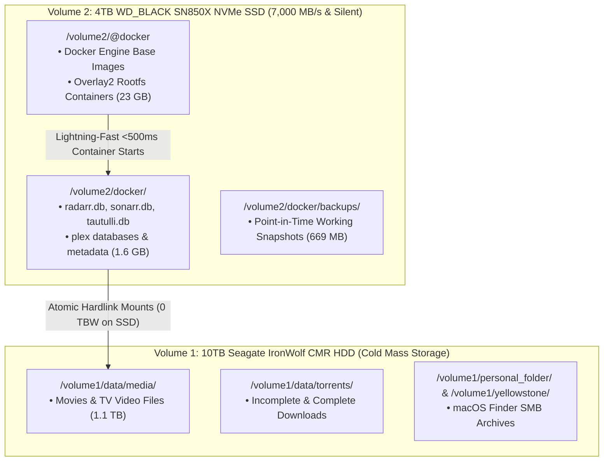

# 📦 UGREEN DXP2800 Storage Tiering, Snapshot Vault & Docker NVMe Engine: Single Source of Truth

> **Context**: Production storage tiering architecture separating high-IOPS stateless container engines from high-capacity cold media storage on the UGREEN DXP2800 NAS. Includes point-in-time configuration snapshot archives and automated container lifecycle management.  
> **Status**: 🟢 **Production Grade / All Services Updated & Verified**  
> **NVMe Tier (`/volume2`)**: 4TB WD_BLACK SN850X NVMe SSD (`/volume2/@docker` + `/volume2/docker`)  
> **CMR HDD Tier (`/volume1`)**: 10TB Seagate IronWolf CMR SATA HDD (`/volume1/data` + SMB Shares)  
> **Active Snapshot Vault**: `/volume2/docker/backups/docker_working_snapshot_20260827_233557.tar.gz` (669 MB)  
> **Last Verified**: 2026-08-27 23:37 PDT

---

## 1. Storage Tiering & TBW Protection Matrix



---

## 2. Resource Utilization & Space Audit

```text
┌────────────────────────────┬─────────────────────────────┬──────────────────────────────────┐
│ Storage Tier / Volume      │ Allocated Data              │ Space Used / Total Capacity      │
├────────────────────────────┼─────────────────────────────┼──────────────────────────────────┤
│ **NVMe SSD (`/volume2`)**  │ Docker Engine + App Configs │ **15 GB Used** / **3.7 TB Free** │
│ **CMR HDD (`/volume1`)**   │ Video Media + SMB Shares    │ **1.1 TB Used** / **8.1 TB Free** │
└────────────────────────────┴─────────────────────────────┴──────────────────────────────────┘
```

---

## 3. Verified Live Container Status

```text
┌────────────────────┬──────────────────────────────────────┬──────────────────────┬──────────────────────────────────┐
│ Container Name     │ Image Tag                            │ Status               │ Live Health / Capabilities       │
├────────────────────┼──────────────────────────────────────┼──────────────────────┼──────────────────────────────────┤
│ `plex`             │ `lscr.io/linuxserver/plex:latest`    │ Up (healthy)         │ QuickSync HW Accel (/dev/dri) 🟢 │
│ `radarr`           │ `lscr.io/linuxserver/radarr:latest`  │ Up (healthy)         │ HTTP 401 (API Key Auth Active) 🟢│
│ `sonarr`           │ `lscr.io/linuxserver/sonarr:latest`  │ Up (healthy)         │ HTTP 401 (API Key Auth Active) 🟢│
│ `prowlarr`         │ `lscr.io/linuxserver/prowlarr:latest`│ Up (healthy)         │ HTTP 401 (API Key Auth Active) 🟢│
│ `tautulli`         │ `lscr.io/linuxserver/tautulli:latest`│ Up (healthy)         │ HTTP 303 (Stream Tracking OK) 🟢 │
│ `bazarr`           │ `lscr.io/linuxserver/bazarr:latest`  │ Up (healthy)         │ HTTP 200 (Subtitle Engine OK) 🟢 │
│ `overseerr`        │ `sctx/overseerr:latest`              │ Up (healthy)         │ HTTP 307 (Media Requests OK) 🟢  │
│ `qbittorrent`      │ `lscr.io/linuxserver/qbittorrent`    │ Up (healthy)         │ HTTP 200 (SATA Direct I/O) 🟢   │
│ `vaultwarden`      │ `vaultwarden/server:latest`          │ Up (healthy)         │ HTTP 200 (Bitwarden Vault OK) 🟢 │
│ `homepage`         │ `ghcr.io/gethomepage/homepage:latest`│ Up (healthy)         │ HTTP 200 (Dashboard Ready) 🟢    │
│ `pihole`           │ `pihole/pihole:latest`               │ Up (healthy)         │ HTTP 200 & Port 53 Dual-DNS 🟢   │
│ `redroid-pixel1`   │ `redroid:11.0.0-pixel1-twin`         │ Up (healthy)         │ ADB Socket 5555 Active 🟢        │
└────────────────────┴──────────────────────────────────────┴──────────────────────┴──────────────────────────────────┘
```

---

## 4. Disaster Recovery & Snapshot Restoration Runbook

If any container ever experiences unexpected behavior after a future update, you can roll back to the exact working state in 5 seconds:

```bash
# 1. Stop all containers
docker stop $(docker ps -q)

# 2. Extract the working snapshot over /volume2/docker
tar -xzf /volume2/docker/backups/docker_working_snapshot_20260827_233557.tar.gz -C /volume2/docker

# 3. Bring stacks back up
for d in /volume2/docker/*; do [ -d "$d" ] && (cd "$d" && docker compose up -d); done
```
