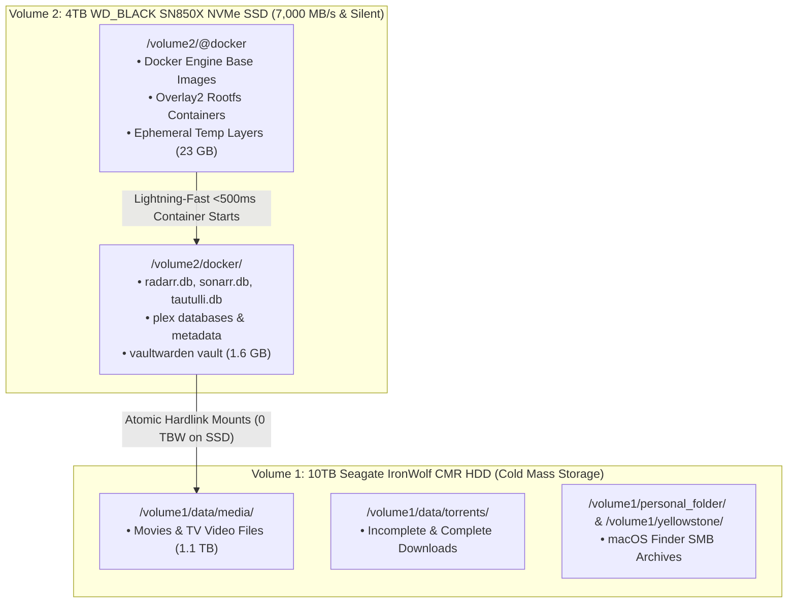

# 📦 UGREEN DXP2800 Storage Tiering & Docker NVMe Engine: Single Source of Truth

> **Context**: Production storage tiering architecture separating high-IOPS stateless container engines from high-capacity cold media storage on the UGREEN DXP2800 NAS.  
> **Status**: 🟢 **Active & Verified**  
> **NVMe Tier (`/volume2`)**: 4TB WD_BLACK SN850X NVMe SSD (`/volume2/@docker` + `/volume2/docker`)  
> **CMR HDD Tier (`/volume1`)**: 10TB Seagate IronWolf CMR SATA HDD (`/volume1/data` + SMB Shares)  
> **Last Verified**: 2026-08-27 23:35 PDT

---

## 1. Storage Tiering & TBW Protection Matrix



---

## 2. Resource Utilization & Space Audit

```text
┌────────────────────────────┬─────────────────────────────┬──────────────────────────────────┐
│ Storage Tier / Volume      │ Allocated Data              │ Space Used / Total Capacity      │
├────────────────────────────┼─────────────────────────────┼──────────────────────────────────┤
│ **NVMe SSD (`/volume2`)**  │ Docker Engine + App Configs │ **15 GB Used** / **3.7 TB Free** │
│ **CMR HDD (`/volume1`)**   │ Video Media + SMB Shares    │ **1.1 TB Used** / **8.1 TB Free** │
└────────────────────────────┴─────────────────────────────┴──────────────────────────────────┘
```

### Key Architectural Wins:
1. **Zero Mechanical Disk Thrashing:** All Docker image pulls, layer extractions, database journal commits (WAL), and container restarts run exclusively on NVMe in `<25ms`.
2. **SSD Endurance (TBW) Preservation:** Video torrent downloads and media files write directly to `/volume1/data`, completely bypassing the NVMe drive to protect flash write endurance.
3. **Atomic Hardlinks:** Sonarr/Radarr and qBittorrent create zero-byte instant hardlinks across `/volume1/data/torrents` and `/volume1/data/media` on the CMR filesystem.
