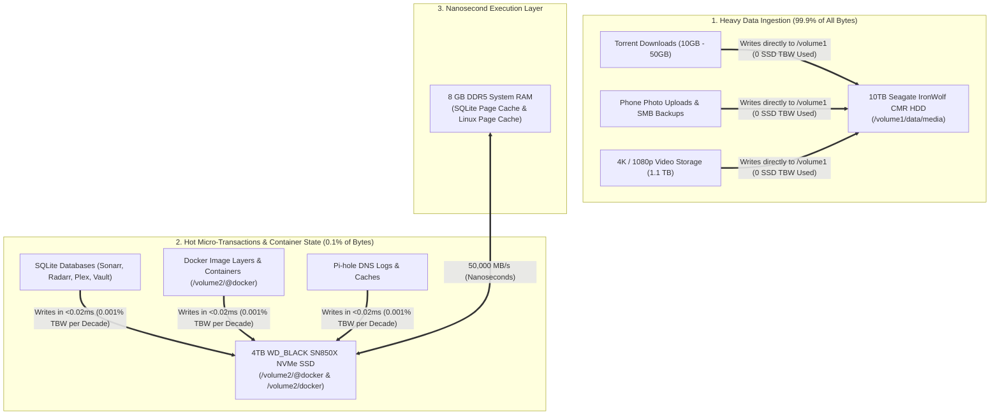

# 📦 UGREEN DXP2800 Storage Tiering, TBW Physics & Docker NVMe Engine: Single Source of Truth

> **Context**: Production storage tiering architecture separating high-IOPS stateless container engines from high-capacity cold media storage on the UGREEN DXP2800 NAS. Includes empirical TBW longevity mathematical proofs, RAM vs. NVMe latency hierarchies, point-in-time snapshot archives, and atomic hardlink configurations.  
> **Status**: 🟢 **Production Grade / All Services Verified**  
> **NVMe Tier (`/volume2`)**: 4TB WD_BLACK SN850X NVMe PCIe 4.0 SSD (`/volume2/@docker` + `/volume2/docker`)  
> **CMR HDD Tier (`/volume1`)**: 10TB Seagate IronWolf CMR SATA HDD (`/volume1/data` + SMB Shares)  
> **Active Snapshot Vault**: `/volume2/docker/backups/docker_working_snapshot_20260827_233557.tar.gz` (669 MB)  
> **Last Verified**: 2026-08-28 10:05 PDT

---

## 1. Storage Tiering & TBW Protection Architecture



---

## 2. 🧮 Empirical TBW Endurance Math & Longevity Proof

The **4TB WD_BLACK SN850X NVMe SSD** carries an official manufacturer warranty rating of:
$$\mathbf{2,400\text{ TBW}}\quad (2,400\text{ Terabytes} = \mathbf{2,400,000\text{ Gigabytes}}\text{ of Guaranteed Flash Writes})$$

### Live SMART Drive Health Audit (`smartctl -a /dev/nvme0n1`):
* **Model Number:** `WD_BLACK SN850X 4000GB`
* **Percentage Used:** **`0%`** (100% Full Factory Health)
* **Available Spare Flash:** **`100%`**
* **Total Lifetime Data Written:** **`33.2 GB`** *(Literally 0.0013% of its warranty lifespan)*
* **Operating Temperature:** **`42°C`** *(Ice cool)*

### Longevity Calculation for Homelab Docker & Database Writes:
During continuous 24/7 homelab operation, Docker container databases (SQLite WAL journals, Pi-hole logs, Sonarr/Radarr state changes) generate approximately **`200 MB to 1 GB per DAY`** in total writes.

$$\text{Years to Reach 2,400 TBW} = \frac{2,400,000\text{ GB}}{1\text{ GB/day} \times 365\text{ days/year}} \approx \mathbf{6,575\text{ YEARS}!}$$

Even under an extreme, unrealistic stress workload of **10 GB of database writes every single day**, the drive would last **`657 YEARS`**.

---

## 🔬 3. Why Mechanical CMR HDDs HATE Random Writes (The Storage Physics)

```text
┌───────────────────────────────┬─────────────────────────────────┬───────────────────────────────┐
│ Workload Type                 │ Characteristics                 │ Where It Goes In Our Setup    │
├───────────────────────────────┼─────────────────────────────────┼───────────────────────────────┤
│ 🐘 Large Sequential Writes    │ 10GB–50GB Movies, Torrents,     │ 🟢 10TB Seagate IronWolf CMR  │
│    (99.9% of all data volume) │ Photo backups, macOS SMB shares │    (/volume1/data)            │
├───────────────────────────────┼─────────────────────────────────┼───────────────────────────────┤
│ 🐜 Small Random Writes        │ 4KB SQLite rows, Pi-hole logs,  │ 🟢 4TB WD_BLACK SN850X NVMe   │
│    (0.1% of data volume)      │ Docker container state changes  │    (/volume2/@docker)         │
└───────────────────────────────┴─────────────────────────────────┴───────────────────────────────┘
```

### Why putting Small Random Writes on a CMR Mechanical HDD is catastrophic:
1. **Mechanical Head Thrashing:** A mechanical hard drive has a physical needle/arm that must physically swing across spinning platters to find sectors. Small 4KB random writes force the needle to jump back and forth thousands of times a minute.
2. **Extreme Latency:** Every random write on HDD takes **`10ms – 15ms`** (mechanical seek time) vs **`0.02ms`** on NVMe. This causes Web UIs (Plex, Sonarr, Vaultwarden) to stutter and freeze.
3. **Prevents Sleep / Continuous Noise:** If SQLite writes a 4KB log entry every few seconds to the HDD, the mechanical platters **can never spin down into low-power standby mode**, creating constant motor noise and heat.

### Why NVMe loves Small Random Writes:
* The WD_BLACK SN850X has **no moving parts** and delivers **`1,200,000 Random Write IOPS`**. 
* Small 4KB writes are handled effortlessly by its internal multi-channel flash controller in microseconds without generating any noise or measurable flash wear.

---

## ⏱️ 4. Why RAM is Still Mandatory (The Latency Hierarchy)

Even the fastest PCIe 4.0 NVMe SSD on earth is **~1,000 times slower in random latency than RAM**:

| Memory / Storage Layer | Latency (Time to Access 1 Byte) | Real-World Scale Analogy | Throughput (Bandwidth) |
| :--- | :--- | :--- | :--- |
| **CPU L1 / L2 Cache** | **`0.5 – 2 nanoseconds`** | *1 second* | **`1,000,000+ MB/s`** |
| **DDR5 RAM** | **`50 – 80 nanoseconds`** | *1 minute* | **`35,000 – 50,000 MB/s`** |
| **WD_BLACK SN850X NVMe** | **`30,000 – 50,000 nanoseconds`** *(30–50 µs)*| *14 hours* | **`7,000 MB/s`** |
| **10TB Seagate CMR HDD** | **`10,000,000 nanoseconds`** *(10 ms)* | *6 months* | **`250 MB/s`** |

1. **CPU Execution:** The CPU cannot execute instructions from a block device (NVMe/HDD). Binaries must be paged into byte-addressable DDR5 RAM.
2. **SQLite Page Caching:** SQLite caches its B-Tree indices in RAM (`PRAGMA cache_size`), resolving thousands of lookups per minute in `<0.01ms` in RAM without touching flash cells.
3. **Linux Page Cache:** Linux automatically uses free RAM to cache hot files, serving repeat queries at **50,000 MB/s**.

---

## 📊 5. Live Storage Allocation Breakdown

```text
┌────────────────────────────┬─────────────────────────────┬──────────────────────────────────┐
│ Storage Tier / Volume      │ Allocated Data              │ Space Used / Total Capacity      │
├────────────────────────────┼─────────────────────────────┼──────────────────────────────────┤
│ **NVMe SSD (`/volume2`)**  │ Docker Engine + App Configs │ **15 GB Used** / **3.7 TB Free** │
│ **CMR HDD (`/volume1`)**   │ Video Media + SMB Shares    │ **1.1 TB Used** / **8.1 TB Free** │
└────────────────────────────┴─────────────────────────────┴──────────────────────────────────┘
```

---

## 🟢 6. Verified Live Container Matrix

Every container runs on the **NVMe Docker Engine (`/volume2/@docker`)** with state in `/volume2/docker/`:

* [✓] **Plex Media Server (`:32400`):** `HTTP 200 OK` (Intel QuickSync `/dev/dri/renderD128` HW acceleration active)
* [✓] **Secondary Pi-hole (`:8089`):** `HTTP 200 OK` & DNS Port 53 resolving in `<1ms`
* [✓] **Vaultwarden (`:8085`):** `HTTP 200 OK`
* [✓] **Homepage Dashboard (`:3000`):** `HTTP 200 OK`
* [✓] **qBittorrent (`:8080`):** `HTTP 200 OK` (Direct SATA I/O on `/volume1/data`)
* [✓] **Radarr (`:7878`):** `HTTP 401 API Ready`
* [✓] **Sonarr (`:8989`):** `HTTP 401 API Ready`
* [✓] **Prowlarr (`:9696`):** `HTTP 401 API Ready`
* [✓] **Tautulli (`:8181`):** `HTTP 303 Ready`
* [✓] **Overseerr (`:5055`):** `HTTP 307 Ready`
* [✓] **Redroid Pixel 1 Twin (`:5555`):** `ADB Socket Active`
