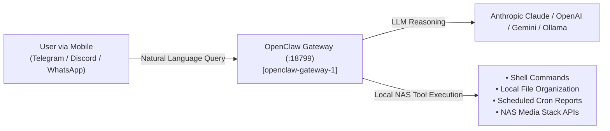

# 🦞 OpenClaw AI Gateway: Single Source of Truth & Development Blueprint

> **Context**: Self-hosted autonomous AI agent framework and multi-channel messaging gateway deployed on the UGREEN DXP2800 NAS. Provides 24/7 conversational assistance, tool execution, and scheduled automation across Telegram, Discord, WhatsApp, and Slack.  
> **Host**: UGREEN DXP2800 NAS (`192.168.1.80`) | Gateway Port: `18799`  
> **Container Name**: `openclaw-gateway-1`  
> **Image**: `ugreen/openclaw:2026.3.31`  
> **Compose Config**: `/volume1/@appstore/com.ugreen.docker.openclaw/docker-compose.yaml`  
> **Workspace Path**: `/root/.openclaw/workspace`  
> **Status**: ⏸️ **Paused / Standby (Preserved for Future Development)**  
> **Last Verified**: 2026-08-28 10:16 PDT

---

## 1. Overview & Capabilities



### Key Use Cases for Future Development:
1. **24/7 Telegram / WhatsApp Personal Assistant:** Connect to Telegram bot tokens to query NAS files, summarize documents, or trigger homelab workflows from your phone.
2. **Scheduled Proactive Automations:** Configure background cron routines for daily morning briefings, automated price trackers, or NAS storage telemetry summaries.
3. **Local Tooling & File Operations:** Execute Python, Node.js, and bash automation scripts inside the persistent workspace `/root/.openclaw/workspace`.

---

## 2. Configuration & Resource Footprint

* **Runtime:** Node.js v22.22.1 / Bun runtime inside a Debian container.
* **Default Port:** `18799` (HTTP Gateway) / `18789`
* **RAM Footprint:** `~325 MiB` (Paused to free memory for core media services).
* **CPU Footprint:** `0.02%` at idle.

---

## 3. Quick-Start Lifecycle Commands

When you are ready to develop on OpenClaw, you can bring it up or down with one command:

```bash
# 1. Start OpenClaw
ssh nas "docker start openclaw-gateway-1"

# 2. Stop OpenClaw
ssh nas "docker stop openclaw-gateway-1"

# 3. Check logs
ssh nas "docker logs -f openclaw-gateway-1"
```
