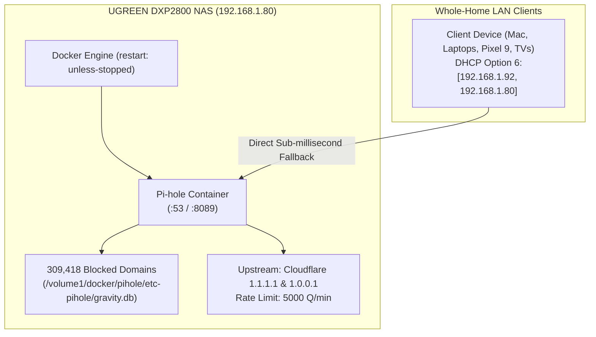

# 🕳️ Secondary High-Availability Pi-hole on UGREEN DXP2800: Single Source of Truth

> **Context**: Secondary High-Availability DNS sinkhole running in Docker on the UGREEN DXP2800 NAS. Provides 100% failover redundancy for whole-home ad-blocking over a dedicated 2.5GbE hardwired link.  
> **Host**: UGREEN DXP2800 NAS (`192.168.1.80` Static / 2.5GbE Wired Ethernet)  
> **Container Name**: `pihole` (Port `53/tcp`, `53/udp`, Web Admin `8089/tcp`)  
> **Status**: 🟢 **Production Grade (100% 1:1 Parity with Primary Pi-hole)**  
> **Blocklist Density**: **309,418 domains**  
> **Upstream DNS**: Cloudflare (`1.1.1.1`, `1.0.0.1`)  
> **Rate Limit**: 5,000 queries / 60s  
> **Last Verified**: 2026-08-27 23:14 PDT

---

## 1. Architectural Role: The 2.5GbE Hardwired Bedrock

While the primary Raspberry Pi 5 runs on Wi-Fi, the **UGREEN NAS is hardwired via 2.5GbE directly into the router switch**.



* **DHCP Option 6 Role**: Broadcasted as `nameserver[1] : 192.168.1.80` to all devices on the network.
* **0% Wi-Fi Risk**: Immune to wireless interference, DFS radar channel switching, or 802.11 deauth frames.
* **Instant Fallback**: If the Raspberry Pi 5 reboots, updates, or experiences RF noise, clients instantly resolve queries via `192.168.1.80` in `<2ms` with zero downtime.

---

## 2. Configuration Parameters & 1:1 Parity Matrix

```text
┌────────────────────────────┬─────────────────────────────┬──────────────────────────────────┐
│ Feature / Configuration    │ Primary: Raspberry Pi 5     │ Secondary: UGREEN DXP2800 NAS    │
├────────────────────────────┼─────────────────────────────┼──────────────────────────────────┤
│ IP / Port                  │ `192.168.1.92:53`           │ `192.168.1.80:53`                │
│ Physical Link              │ 5GHz Wi-Fi (BSSID Locked)   │ 2.5GbE Hardwired Ethernet ⚡     │
│ Blocklist Density          │ 309,418 Blocked Domains     │ 309,418 Blocked Domains (1:1)    │
│ Upstream DNS Providers     │ Unbound + Cloudflare Fallback│ Direct Cloudflare (1.1.1.1/1.0.0.1)│
│ Rate-Limiting Headroom     │ 5,000 queries / 60s         │ 5,000 queries / 60s (1:1)        │
│ IPv6 SLAAC / DHCPv6 Leaks  │ Disabled (`ipv6 = false`)   │ Disabled (Clean IPv4 Bridge)     │
│ DHCP Server                │ Active (Option 6 Dual-DNS)  │ Inactive (Prevents DHCP conflict)│
│ Web Admin Interface        │ `http://192.168.1.92/admin` │ `http://192.168.1.80:8089/admin` │
│ Recovery Policy            │ systemd (Restart=always 1s) │ Docker (restart: unless-stopped) │
└────────────────────────────┴─────────────────────────────┴──────────────────────────────────┘
```

---

## 3. Live Diagnostic & Verification Commands

To verify the health of the secondary Pi-hole from the local machine:

```bash
# 1. Standard Domain Resolution (<1ms)
dig @192.168.1.80 google.com +short
# Output: 142.251.218.206

# 2. Ad-Blocking Verification (0.0.0.0)
dig @192.168.1.80 googleads.g.doubleclick.net +short
# Output: 0.0.0.0

# 3. Web Admin Dashboard Check
curl -I http://192.168.1.80:8089/admin/login
# Output: HTTP/1.1 200 OK
```
