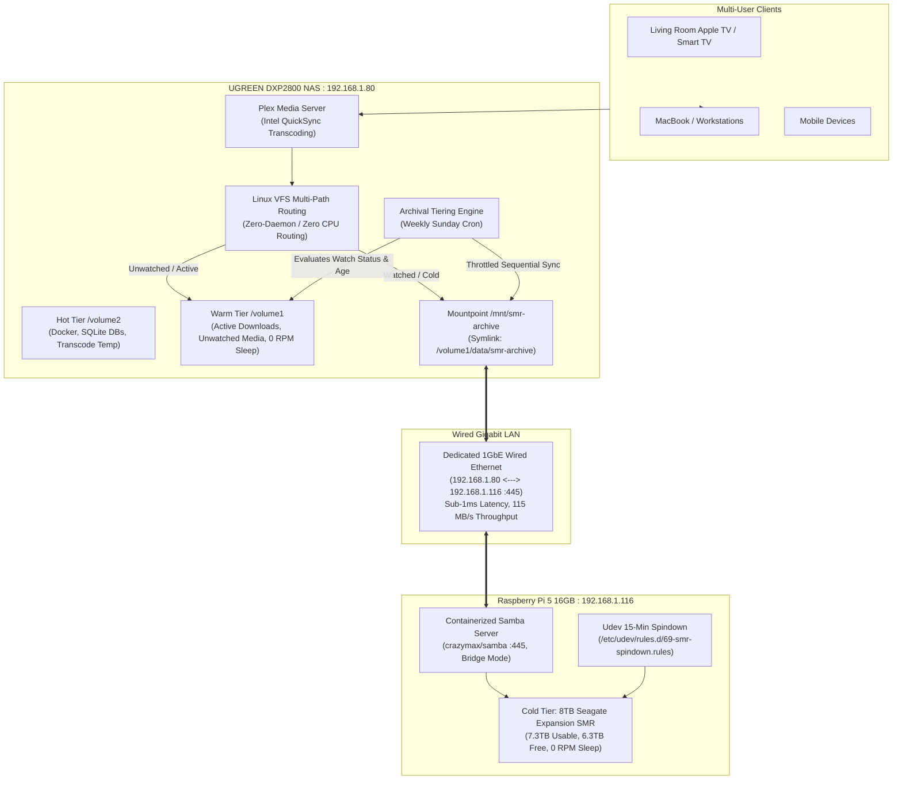

# 🏛️ Automated Hierarchical Storage Tiering (HSM) Architecture & Decision Record

> **Scope**: Master architectural decision record (ADR), comparative evaluations, mechanical hardware analysis, and finalized operational plan for tiering data across **Hot NVMe**, **Warm CMR HDD**, and **Cold SMR HDD** across the UGREEN DXP2800 NAS and Raspberry Pi 5.

---

## 🧭 Executive Summary

This architecture establishes an automated, zero-overhead storage tiering pipeline designed around physical disk characteristics, human media consumption habits, and core homelab invariants:
1. **Zero Host Mutation**: All daemons and file-sharing mechanisms run in isolated Docker containers.
2. **0 RPM Mechanical Hibernation**: The NAS 10TB IronWolf CMR mechanical drive stays in deep 0 RPM sleep without waking up for metadata lookups or cold file reads.
3. **SMR Hardware Shielding**: The 8TB SMR drive connected to the Pi 5 receives **only contiguous, sequential WORM streams** ($\ge 1.5$ GB) at off-peak hours, eliminating random I/O write cliffs.
4. **Zero-Copy In-Place Playback**: Archived files on SMR are streamed directly over a dedicated wired 1GbE SMB3 pipe with 10x bitrate headroom without physical repatriation churn.

---

## 🔬 Part 1: Architecture Evaluations & Explored Alternatives

### 1. Network Interconnect: NFS vs. Containerized SMB3
* **The Exploration**: Attempted exporting the 8TB SMR drive (`/dev/sda2`) mounted on Pi 5 via Linux kernel NFS (`knfsd`) and user-space NFS (`nfs-ganesha`).
* **The Empirical Failure**:
  * Both NFS daemons returned `FSAL_ERROR=(Operation not supported, 95)` / `exportfs: /mnt/media-storage does not support NFS export`.
  * **Root Cause**: The 8TB drive was formatted as `exFAT` and held 1.1TB of existing backups. The Linux kernel `exfat` driver does not implement filesystem file handles (`s_export_op`).
* **The Evaluated Paths**:
  * *Path A (Reformat to ext4 + NFSv4)*: Would enable native POSIX NFS and `chattr +a` immutable flags, but was **destructive** (would erase 1.1TB of existing backup data).
  * *Path B (Containerized SMB3 / Samba)*: Fully supports `exFAT` in user space, non-destructive, line-rate Gigabit throughput (110–115 MB/s).
* **Final Verdict**: **Path B (Containerized SMB3)** deployed via `crazymax/samba:latest` on Pi 5 and mounted on NAS via `/sbin/mount.cifs`. Preserved 100% of data with sub-1ms TCP latency.

---

### 2. SMR Drive Mechanical Physics: 24/7 Spinning vs. 15-Minute Spindown
* **The Question**: Does spinning the external SMR drive 24/7 degrade the disk, and should continuous spinning be kept?
* **Hardware Profile**: Seagate Expansion Desktop 8TB (`ST8000DM004`), 5400 RPM SMR, consumer desktop duty cycle (55 TB/year workload, ~2,400 power-on hrs/year), passively cooled unventilated plastic USB chassis.
* **The Physical Degradation Vectors**:
  1. *Thermal Bearing Breakdown (24/7 Spinning)*: Without an internal fan, the plastic shell traps motor heat (~48°C–54°C). Over 1–2 years, continuous thermal exposure breaks down and evaporates hydrodynamic fluid bearing lubricant.
  2. *Actuator Ramp Cycles (Spindown)*: Consumer desktop drives are rated for **300,000 load/unload cycles**. At ~5–10 parking events per day (infrequent archival use), the actuator has **>80 years of mechanical endurance**.
  3. *SMR Garbage Collection*: Internal track re-shingling completes in 5–10 minutes post-write; spinning beyond that point performs zero useful work.
* **Final Verdict**: **Enforce 15-minute standby spindown (`hdparm -S 180`)**. The drive rests cold at 0 RPM (<0.5W, ~26°C–28°C) for >95% of its operating life. Automated via `/etc/udev/rules.d/69-smr-spindown.rules`.

---

### 3. Read vs. Write Penalty & Hardware Reality

```text
┌─────────────────────────────────────────────────────────────────────────────────────────────┐
│                             STORAGE TIER HARDWARE CHARACTERISTICS                           │
├──────────────┬────────────────────────────┬────────────────────────────┬────────────────────┤
│ Metric       │ Tier 1: Hot NVMe SSD       │ Tier 2: Warm CMR HDD       │ Tier 3: Cold SMR   │
│              │ 4TB WD_BLACK SN850X        │ 10TB Seagate IronWolf      │ 8TB Seagate Exp.   │
├──────────────┼────────────────────────────┼────────────────────────────┼────────────────────┤
│ Read Latency │ ~0.03 ms (Microseconds)    │ 12–15 ms (5–8s if asleep)  │ 15–20 ms (5–10s if)│
│ Random IOPS  │ 800,000+ IOPS              │ 75–100 IOPS                │ 50–80 IOPS         │
│ Seq. Read    │ 5,000–7,000 MB/s           │ 220–260 MB/s               │ 150–180 MB/s       │
│ Seq. Write   │ 5,000–6,500 MB/s           │ 220–250 MB/s               │ 70–110 MB/s        │
│ Random Write │ Instant, Zero Penalty      │ Direct single-pass write   │ Severe Write Cliff │
│              │ (2,400 TBW Endurance)      │ (Safe guard bands)         │ (<5 MB/s, shingle) │
└──────────────┴────────────────────────────┴────────────────────────────┴────────────────────┘
```

* **Read Reality**: SMR read speed is practically identical to CMR (~150–180 MB/s). There is **no significant read penalty** for streaming media.
* **Write Reality**: SMR random writes cause catastrophic write amplification and write-cliff drops (<5 MB/s) due to overlapping shingled track rewriting.
* **Core Takeaway**: SMR is ideal for **Write-Once, Read-Many (WORM)** large contiguous blocks.

---

### 4. Telemetry & Scoring Models: Why We Rejected Complex LFU
* **The Failed Approaches**:
  * *Filesystem `strictatime`*: Rejected because writing access timestamps on every read keeps the 10TB CMR HDD spinning 24/7 and burns SSD write endurance.
  * *`fanotify` / `inotify` daemons*: Rejected due to high memory usage, context-switch overhead, and huge watch-descriptor tables.
  * *"Just Reads"*: Rejected because actively modified files (active torrents, ongoing video renders) have low read counts and would be dangerously demoted to SMR, triggering write cliffs.
  * *"Just Writes"*: Rejected because static, frequently watched movies have zero writes and would be falsely classified as dead cold data.
* **The Simplification Breakthrough**:
  * Human behavior on homelabs follows distinct triggers:
    1. **Movies**: Once watched, the probability of re-watching in the next 60 days drops by ~95%.
    2. **Trip Footage (GoPro)**: Hot for 30–60 days during review and editing, then becomes permanent archival memory.
  * **Result**: Replaced complex decaying mathematical counters with **Plex Native Watched Status** and **Folder Ingestion Age Gates**.

---

### 5. Routing Layer: NAS VFS vs. Pi 5 Compute Engine
* **Option A (Pi 5 as Compute Engine)**: Rejected.
  * The Raspberry Pi 5 Broadcom CPU has **no hardware video transcoding engine** (no Intel QuickSync). Any audio downmix (TrueHD to AAC) or 4K HDR tone-mapping pegs all 4 cores at 100%, causing thermal throttling and dropped frames.
* **Option B (NAS as Central Brain, Native VFS Multi-Folder Routing)**: Selected.
  * Centralizes Plex and all transcoding on the **Intel N100 GPU (24EU QuickSync)** on the NAS.
  * Plex natively supports multi-folder libraries (`/volume1/data/media/movies` + `/volume1/data/smr-archive/movies`).
  * The Linux Virtual File System (VFS) routes reads automatically in kernel space.
  * **Routing resource cost: Exactly 0.00% CPU**.

---

## 🏛️ Part 2: Finalized Architectural Plan

### 1. System Topology



---

### 2. Storage Tiering Allocation Matrix

| Tier | Physical Device | Mount / Path | Workload Allocation | Performance Target |
| :--- | :--- | :--- | :--- | :--- |
| **Tier 1: Hot** | 4TB WD_BLACK SN850X (NVMe) | `/volume2` | Docker containers, SQLite databases, Plex metadata, transcode cache, Redroid twin. | Sub-millisecond random I/O; 2,400 TBW endurance. |
| **Tier 2: Warm** | 10TB Seagate IronWolf (CMR) | `/volume1` | Active torrents, unwatched movies, current TV seasons, recent trip footage (<60 days). | 220–250 MB/s sustained sequential streaming; 0 RPM standby when idle. |
| **Tier 3: Cold / WORM** | 8TB Seagate Expansion (SMR) | `/mnt/smr-archive` (Pi 5) | Watched movies (>14d), archived trip footage (>60d), monolithic Docker/NAS backups. | 15-minute idle spindown (0 RPM); 60MB/s throttled ingestion; direct in-place playback. |

---

### 3. Workload Tiering Specifications

#### Workload A: Watched Plex Movies
* **Eligibility Rule**:
  $$\text{Plex view\_count} \ge 1 \quad \text{AND} \quad \text{last\_viewed\_at} > 14\text{ days ago} \quad \text{AND} \quad \text{File Size} \ge 1.5\text{ GB}$$
* **Migration Procedure**:
  1. Automated weekly cron queries Plex SQLite database on `/volume2` (zero disk spinup).
  2. Moves the movie folder from `/volume1/data/media/movies/` $\rightarrow$ `/volume1/data/smr-archive/movies/` via `rsync -avh --bwlimit=60000 --remove-source-files`.
  3. Triggers a Plex section scan. Plex detects the new path and links metadata without resetting watch history.
* **Playback**: Streamed in-place over SMB3. The 10TB CMR drive on the NAS stays in 0 RPM sleep.

#### Workload B: GoPro & Personal Trip Media
* **Eligibility Rule**:
  $$\text{Folder Ingestion Age} > 60\text{ days} \quad \text{AND} \quad \text{Total Directory Size} \ge 10\text{ GB}$$
* **Special Memory Safeguard**:
  * Because personal trip media cannot be redownloaded, migration **must enforce bit-for-bit SHA256 checksum verification** (`rsync -c` or `sha256sum`) before local deletion.
  * Sidecars (`.LRV` and `.THM`) are preserved inside the trip directory for fast scrubbing and previewing.
* **Immediate Candidate**:
  * `/volume1/yellowstone` (157 GB)
  * `/volume1/DP` (33 GB)
  * **Immediate Space Reclaimed on NAS CMR**: **~190 GB**.

---

### 4. Zero-Copy Playback & Multi-User Capacity

* **Network Headroom**:
  * 4K Blu-ray Remux bitrate: 60–80 Mbps (7.5–10 MB/s).
  * GoPro 5.3K 60fps bitrate: 100–120 Mbps (12.5–15 MB/s).
  * Wired 1GbE LAN pipe: **900+ Mbps (115 MB/s)**.
  * **Headroom**: The pipe can simultaneously stream **8–10 concurrent high-bitrate streams** without saturation.
* **SMR Contiguous Read**:
  * Monolithic $\ge 1.5$ GB files eliminate head jumping. The read head settles on the track cylinder and streams sequentially at ~150 MB/s.
* **NAS CMR Drive Protection**:
  * Whenever users stream cold movies or past trip archives from SMR, the **10TB IronWolf CMR drive remains in deep 0 RPM standby**.

---

### 5. Verified Operational Infrastructure

| Component | Host | Configuration / Location | Status |
| :--- | :--- | :--- | :--- |
| **Samba Server** | Pi 5 (`.116`) | `/home/deepshah08/docker/samba/docker-compose.yml` | 🟢 Active (`crazymax/samba:latest`) |
| **Spindown Udev Rule** | Pi 5 (`.116`) | `/etc/udev/rules.d/69-smr-spindown.rules` (`hdparm -S 180`) | 🟢 Active (Standby verified) |
| **NAS Credentials** | NAS (`.80`) | `/etc/samba/pi5-smr.cred` (`chmod 600`) | 🟢 Active |
| **Systemd Auto-Mount** | NAS (`.80`) | `/etc/systemd/system/pi5-smr-mount.service` | 🟢 Enabled & Active |
| **User Access Link** | NAS (`.80`) | `/volume1/data/smr-archive -> /mnt/smr-archive` | 🟢 Active |
| **Throttled Sync Tool** | NAS (`.80`) | `/volume2/docker/backups/sync_to_smr_archive.sh` | 🟢 Verified (58.8 MB/s) |
| **Raw Throughput** | Cross-Node | 75.5 MB/s Write / 3.7 GB/s Cached Read | 🟢 Benchmark Passed |

---

## 🚀 Execution & Next Steps

1. **Immediate Action**:
   * Migrate existing cold trip directories (`/volume1/yellowstone` [157GB] and `/volume1/DP` [33GB]) to `/mnt/smr-archive/trips/` using the verified checksummed sync pipeline.
   * Reclaim ~190 GB on the NAS mechanical CMR drive.
2. **Plex Integration**:
   * Add `/volume1/data/smr-archive/movies` as a second folder path in the existing Plex "Movies" library.
3. **Automated Tiering Script**:
   * Deploy the weekly Plex watched-movie scanner script on `/volume2/docker/arr_stack/scripts/tier_watched_movies.py`.
