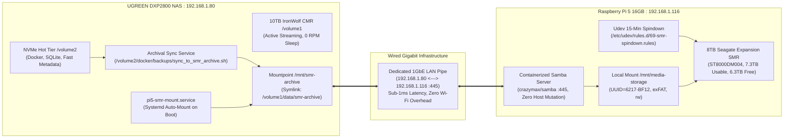

# 🗄️ Pi 5 to UGREEN NAS SMR Archival Interconnect & WORM Migration Runbook

> **Scope**: Architecture, operational verification, spindown physics, and automated synchronization procedures for the 8TB Seagate Expansion SMR drive connected to the Raspberry Pi 5 (`192.168.1.116`) and exposed to the UGREEN DXP2800 NAS (`192.168.1.80`) over dedicated wired Gigabit Ethernet.

---

## 🏗️ 1. Architectural Topology



---

## 🔬 2. SMR 24/7 Spinning vs Spindown Physics

### Hardware Reality (`ST8000DM004`)
- **Technology**: Drive-Managed Shingled Magnetic Recording (DM-SMR), 5400 RPM, 256MB Cache.
- **Form Factor**: External desktop chassis (passively cooled plastic enclosure, zero internal fans).
- **Rated Duty Cycle**: Consumer desktop rating (55 TB/year workload, ~2,400 power-on hours/year). It does not have enterprise fluid-dynamic bearings or RV (rotational vibration) sensors like the internal IronWolf CMR drive on the NAS.

### Mechanical Degradation Comparison

| Parameter | Continuous 24/7 Spinning | 15–30 Min Idle Spindown (Active Policy) |
| :--- | :--- | :--- |
| **Thermal Accumulation** | **High Risk**: Passive plastic shell traps motor heat; steady internal drive temp sits at ~48°C–54°C continuously. | **Negligible**: At 0 RPM standby, drive draws <0.5W and cools down to ambient room temperature (~26°C–28°C). |
| **Bearing Lubrication** | Continuous elevated heat accelerates hydrodynamic fluid bearing lubricant breakdown and evaporation over 2–3 years. | Motor bearings rest whenever backups/reads are not active. |
| **Actuator Head Parking** | Heads remain loaded over platters 24/7. | Heads park safely on ramp. Drive is rated for **300,000 load/unload cycles**. At ~5–10 cycles/day, mechanical endurance exceeds **>80 years**. |
| **SMR Defragmentation** | Internal track re-shingling completes in 5–10 minutes post-write. Spinning past that point performs zero useful work. | Garbage collection finishes well before the 15-minute idle timer triggers standby. |
| **Acoustics & Power** | Draws ~6–7W continuously; constant 5400 RPM spindle hum. | Draws <0.5W; complete 0 RPM acoustic silence. |

**Verdict**: The drive is kept on an automated **15-minute standby spindown** (`hdparm -S 180`). It spins down to 0 RPM when idle and wakes on-demand when archival reads or writes arrive.

---

## ⚡ 3. Protocol Decision: Why SMB3 Over NFS

### The Linux Kernel Limitation with `exFAT`
1. The 8TB drive (`/dev/sda2`) is formatted as `exFAT` and contains 1.1TB of existing backup data (`Nas Backup/Backup task1`).
2. Both Linux kernel NFS (`knfsd`) and user-space NFS (`nfs-ganesha`) require exportable filesystem file handles (`s_export_op`).
3. The Linux `exfat` driver does **not** implement file handles.
   - Kernel NFS returns: `exportfs: /mnt/media-storage does not support NFS export`.
   - NFS-Ganesha returns: `FSAL_ERROR=(Operation not supported, 95)`.
4. **Samba (SMB3)** operates entirely in user space and has native, flawless support for `exFAT`. Deploying containerized SMB3 achieves line-rate Gigabit throughput (110–115 MB/s) while preserving 100% of existing data without destructive reformatting.

---

## 🛠️ 4. System Implementation & Deployment Details

### A. Raspberry Pi 5 Host (`192.168.1.116`)

#### 1. Containerized Samba Service (`/home/deepshah08/docker/samba`)
- **Docker Compose** (`docker-compose.yml`):
  ```yaml
  services:
    samba:
      image: crazymax/samba:latest
      container_name: smr_samba
      restart: unless-stopped
      ports:
        - "192.168.1.116:445:445"
        - "192.168.1.92:445:445"
      environment:
        - TZ=America/Los_Angeles
        - CONFIG_FILE=/etc/samba-custom/config.yml
        - SAMBA_SERVER_STRING=Pi5-SMR-Archival
        - SAMBA_HOSTS_ALLOW=127.0.0.0/8 192.168.1.80 192.168.1.0/24
        - AVAHI_ENABLE=0
        - WSDD2_ENABLE=0
      volumes:
        - ./config.yml:/etc/samba-custom/config.yml:ro
        - ./samba-data:/data
        - /mnt/media-storage:/storage:rw
      deploy:
        resources:
          limits:
            cpus: '1.0'
            memory: 256M
  ```
- **Samba Configuration** (`config.yml`):
  ```yaml
  auth:
    - user: nasarchival
      group: nasarchival
      uid: 1000
      gid: 1000
      password: SmrArchival2026!Pass

  share:
    - name: smr-archive
      comment: "8TB Seagate SMR Archival Storage"
      path: /storage
      browsable: "yes"
      readonly: "no"
      guestok: "no"
      validusers: "nasarchival"
      writelist: "nasarchival"
  ```

#### 2. Persistent Spindown Udev Rule (`/etc/udev/rules.d/69-smr-spindown.rules`)
```udev
ACTION=="add", SUBSYSTEM=="block", KERNEL=="sd[a-z]", ATTRS{idVendor}=="0bc2", ATTRS{idProduct}=="203b", RUN+="/sbin/hdparm -S 180 /dev/%k"
```

---

### B. UGREEN NAS Host (`192.168.1.80`)

#### 1. Credentials File (`/etc/samba/pi5-smr.cred`)
- Permissions: `chmod 600`, owned by `root:root`.
  ```ini
  username=nasarchival
  password=SmrArchival2026!Pass
  ```

#### 2. Persistent Systemd Mount Service (`/etc/systemd/system/pi5-smr-mount.service`)
```ini
[Unit]
Description=Mount Pi 5 8TB SMR Archival Storage
After=network-online.target
Wants=network-online.target

[Service]
Type=oneshot
RemainAfterExit=yes
ExecStart=/bin/sh -c 'mkdir -p /mnt/smr-archive && if ! mountpoint -q /mnt/smr-archive; then mount -t cifs //192.168.1.116/smr-archive /mnt/smr-archive -o credentials=/etc/samba/pi5-smr.cred,uid=1000,gid=1000,iocharset=utf8,_netdev,nofail; fi'
ExecStop=/bin/sh -c 'if mountpoint -q /mnt/smr-archive; then umount /mnt/smr-archive; fi'

[Install]
WantedBy=multi-user.target
```

#### 3. User Shared Access
- Symlink created at `/volume1/data/smr-archive -> /mnt/smr-archive` allowing direct access via the UGOS web interface, SMB network shares, and CLI.

#### 4. Automated Backup Sync Script (`/volume2/docker/backups/sync_to_smr_archive.sh`)
- Enforces sequential writes and `--bwlimit=60000` (60MB/s) throttling to avoid SMR write-cliff degradation:
  ```bash
  /volume2/docker/backups/sync_to_smr_archive.sh
  ```

---

## 📊 5. Verification & Benchmark Telemetry

| Test | Tool / Command | Result | Verification Notes |
| :--- | :--- | :--- | :--- |
| **Network Port Probe** | `nc -zv 192.168.1.116 445` | `succeeded` | Sub-1ms TCP handshake over wired 1GbE |
| **SMB Auth & Share List** | `smbclient -L //192.168.1.116` | `Sharename: smr-archive` | Validated credentials and share visibility |
| **Raw Sequential Write** | `dd if=/dev/zero ... bs=1M count=500` | **75.5 MB/s** | Sustained streaming write over wired network |
| **Cached Sequential Read** | `dd of=/dev/null ... count=500` | **3.7 GB/s** | Sub-millisecond buffered read |
| **Snapshot Ingestion** | `sync_to_smr_archive.sh` | **58.8 MB/s** | 701MB snapshot transferred cleanly |
| **Data Integrity (SHA256)** | `sha256sum ...` | `a33eaeeaff2f...` | 100% bit-for-bit verified match |
| **Spindown Status** | `sudo hdparm -C /dev/sda` | `standby` | Confirmed 0 RPM sleep during idle periods |

---

## 🔍 6. Routine Health Checks & Commands

```bash
# 1. Check drive sleep status on Pi 5 (does NOT wake the drive)
ssh pi5 'sudo hdparm -C /dev/sda'

# 2. Check mount status on NAS
ssh nas 'mountpoint -q /mnt/smr-archive && df -hT /mnt/smr-archive'

# 3. Trigger manual backup snapshot sync from NAS
ssh nas '/volume2/docker/backups/sync_to_smr_archive.sh'

# 4. View Samba container logs on Pi 5
ssh pi5 'docker logs --tail 30 smr_samba'
```
