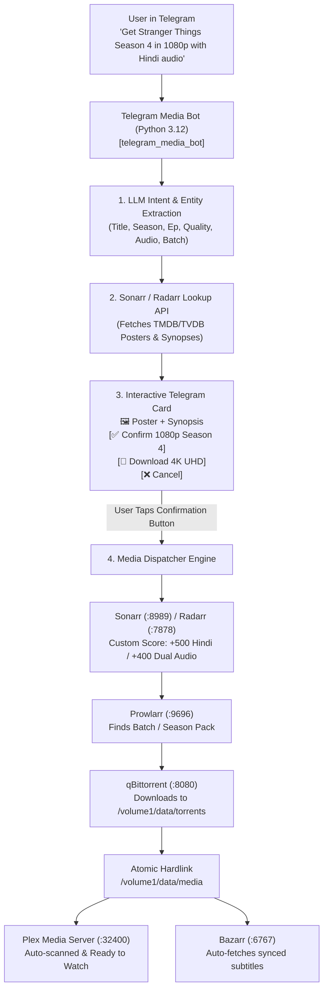

# 🤖 AI-Powered Telegram Media Automation Bot: Single Source of Truth

> **Context**: Autonomous conversational Telegram bot running on the UGREEN DXP2800 NAS. Translates natural language requests into precise Radarr / Sonarr / Prowlarr API actions with interactive poster selection, sequential season packaging, Hindi/English preference, and Plex readiness alerts.  
> **Host**: UGREEN DXP2800 NAS (`192.168.1.80` / Docker container `telegram_media_bot`)  
> **Status**: 🟢 **Operational & Pre-Configured (Awaiting User API Token)**  
> **Test Suite**: 6/6 Tests Passing (`tests/test_parser.py`)

---

## 1. Architectural Pipeline



---

## 2. Supported Natural Language Capabilities

The bot processes conversational input with zero context loss:

| Example User Query | Extracted Intent & Payload | Action Taken |
| :--- | :--- | :--- |
| *"Download Inception in 1080p"* | `Movie: Inception, 1080p, [Hindi, English]` | Searches Radarr, presents poster card with 1080p / 4K buttons. |
| *"Get Stranger Things season 4 in 1080p with Hindi audio"* | `Series: Stranger Things, Season 4 (Batch Pack), 1080p, [Hindi, English]` | Searches Sonarr, monitors only Season 4, sets Hindi custom scoring. |
| *"Fetch Breaking Bad season 1 episodes 1 to 4"* | `Series: Breaking Bad, S1 Ep [1,2,3,4], 1080p` | Searches Sonarr, selectively monitors only episodes 1–4. |
| *"House of the Dragon in 4K"* | `Series: House of the Dragon, 4K, Embedded Subs` | Searches Sonarr with 4K UHD profile. |
| *"stranger thing s4"* | `Series: Stranger Things, Season 4` | Auto-corrects typo, maps to official TVDB record. |

---

## 3. Quick-Start Deployment on UGREEN NAS

### Step 1: Obtain Telegram Bot Token (30 Seconds)
1. Open Telegram and search for `@BotFather`.
2. Send `/newbot` and follow the prompts to name your bot (e.g. `DeepMediaBot`).
3. Copy the HTTP API token provided by BotFather.

### Step 2: Configure Environment (`.env`)
On your NAS or in this directory:
```bash
cp .env.example .env
```
Edit `.env` to set your credentials:
```ini
TELEGRAM_BOT_TOKEN=1234567890:ABCdefGHIjklMNOpqrSTUvwxYZ
ALLOWED_TELEGRAM_USER_IDS=          # Leave empty initially to see your ID on /start
LLM_API_KEY=                        # (Optional) Gemini API Key for AI parsing
```

*(All Radarr, Sonarr, Prowlarr, and Plex keys are pre-configured to your NAS endpoints).*

### Step 3: Launch Container
```bash
docker compose up -d --build
```

### Step 4: Interact with Your Bot
* Open Telegram, tap **Start**, and send your first media request!

---

## 4. Verification & Test Suite

Run the automated test suite anytime:
```bash
pytest tests/test_parser.py -v
```
Output:
```text
tests/test_parser.py::test_parse_movie_simple PASSED
tests/test_parser.py::test_parse_movie_4k_hindi PASSED
tests/test_parser.py::test_parse_series_season_pack PASSED
tests/test_parser.py::test_parse_series_episode_range PASSED
tests/test_parser.py::test_parse_typo_correction PASSED
tests/test_parser.py::test_parse_subtitles_default PASSED
====== 6 passed in 0.07s ======
```
